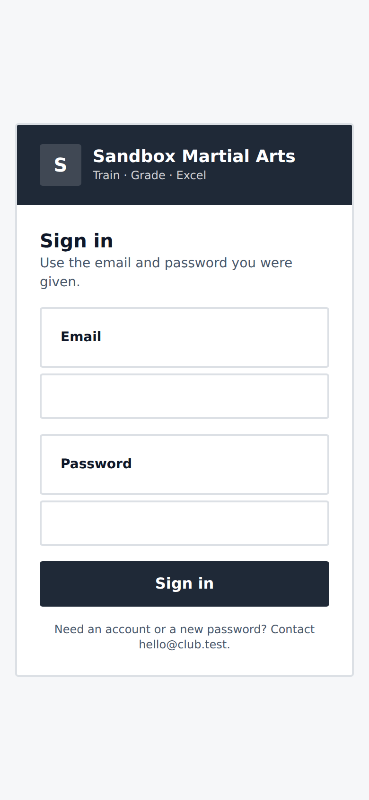
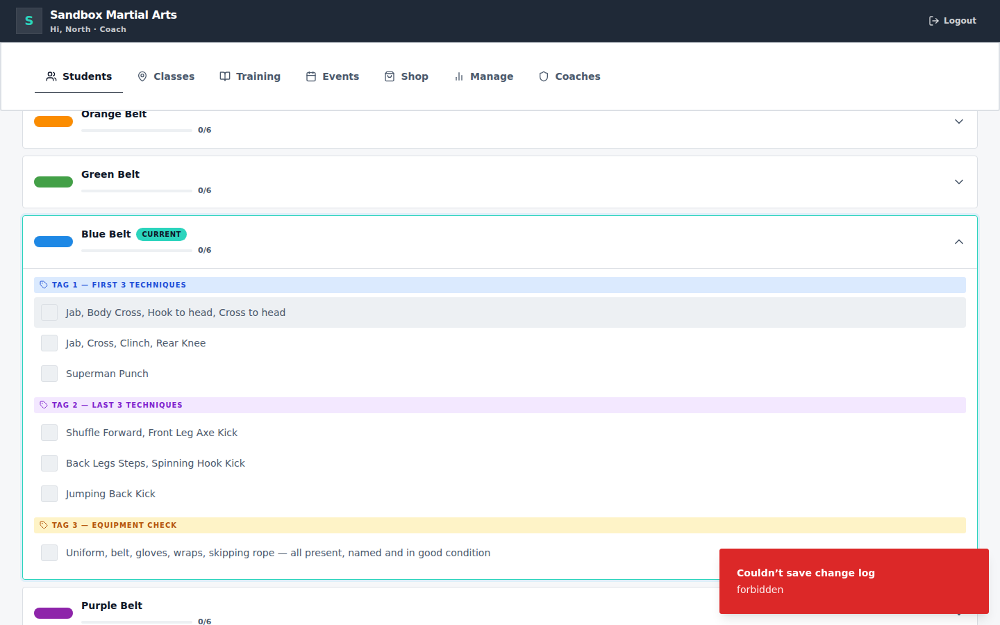
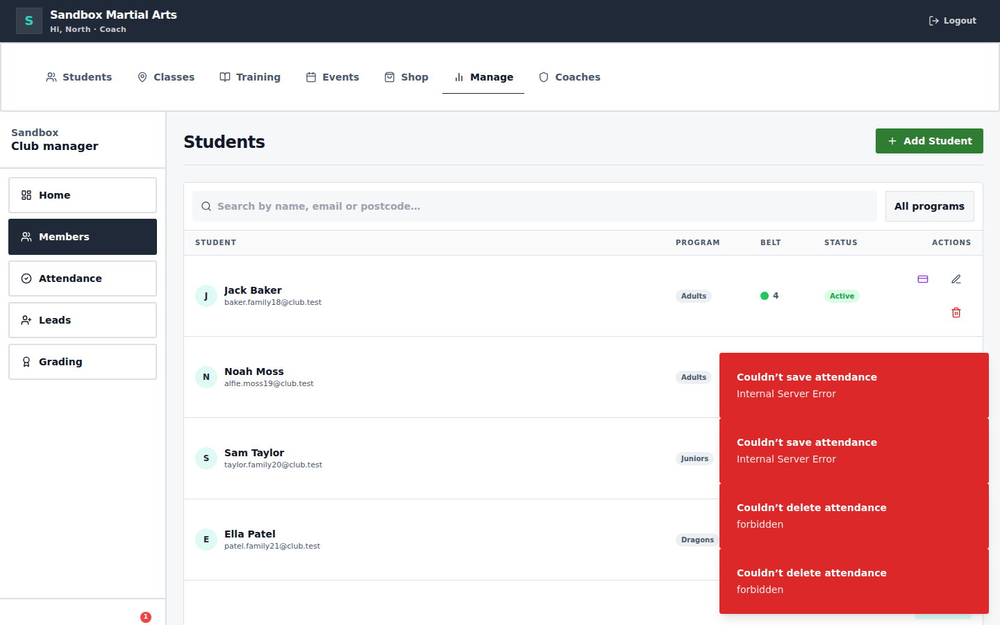
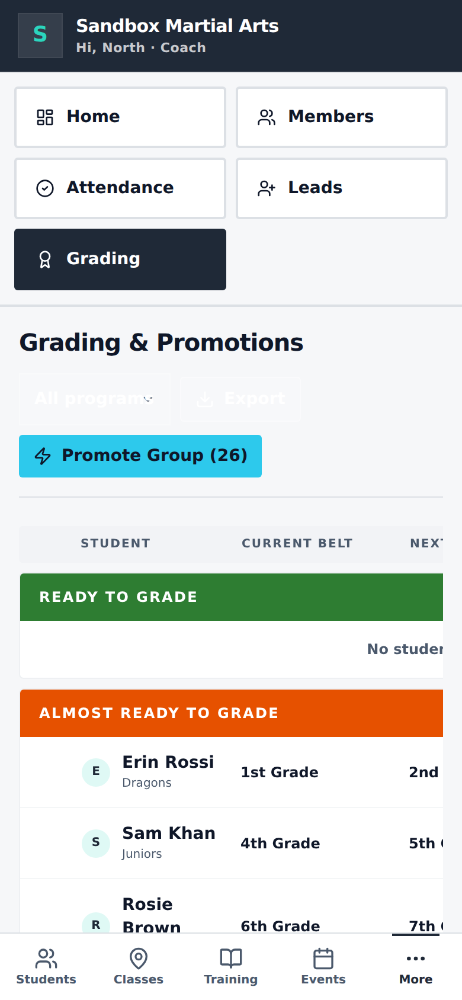
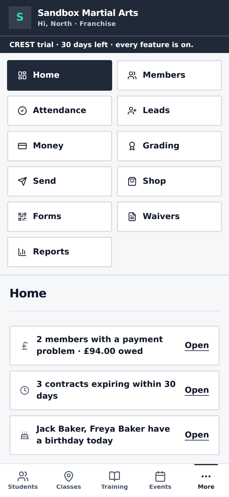
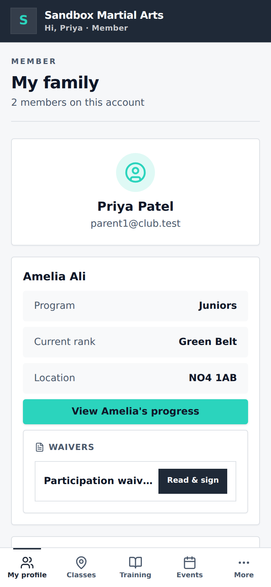
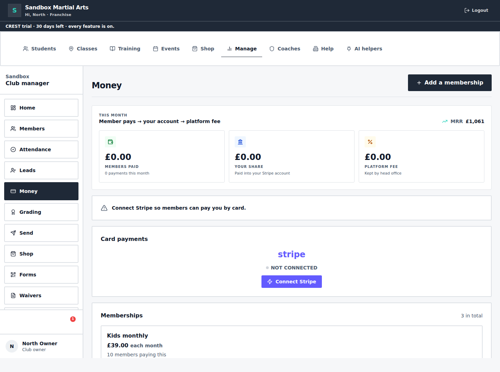
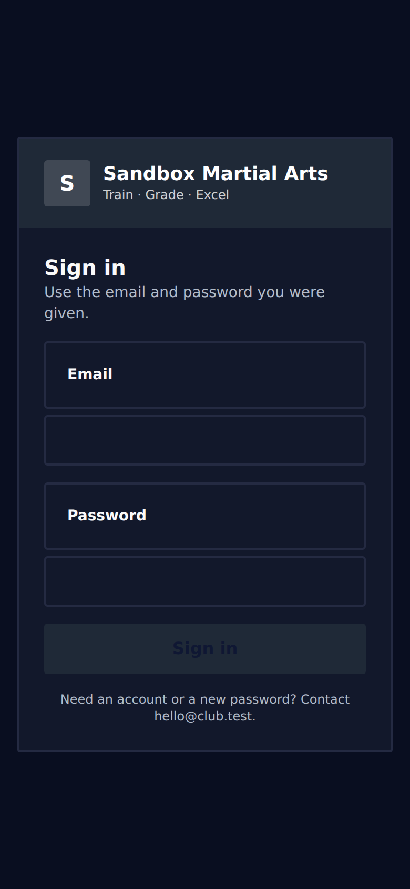

# Focus app · UI audit and improvement plan

Audited 24 September 2026 against the standalone sandbox build of `Tiny1234t/focus-app` (commit 9245099, seeded test club). Ten independent auditors each covered one angle (readability, navigation, interactivity, parent on a phone, coach on the mat, owner dashboards, accessibility, empty states and plain English, consistency with `docs/UI_RULES.md`, forms and modals). 100 raw findings were merged to 66, each checked by a sceptical verifier who reproduced it in the running app or the code and judged whether fixing it helps a real user. 64 were confirmed, 2 rejected. A final completeness pass found 8 more.

## Summary

The audit confirmed 64 problems, but most of what makes the app look broken comes from a handful of small causes rather than 64 separate ones: a single CSS name clash that draws a box round every label, red error boxes that never go away, a hidden history write that makes every skill tick and profile save report failure, and text and buttons smaller than the app's own minimum sizes. Twelve small fixes, most a few lines each, would remove the worst of it in the first day and make the coach's register and the parent's forms feel instant and readable. The bigger moves are putting Manage's sections in the web address so Back and refresh work, making check-ins tick the moment they are tapped, wiring the Home alerts and money figures so an owner can trust and act on them, and explaining card payments in plain words. One thing to do before any of this is checked on screen: rebuild the sandbox (npm run local:build), because the served index.html currently points at a bundle that does not exist and every page loads blank without a workaround.

## Do first: 12 quick wins (in build order)

1. **Stop the .block name clash that draws a box round every label** (small, all) · `rules-consistency/block-class-collision`
2. **Red error boxes never go away, pile up, follow you between screens and speak in code** (small, all) · `interactivity/error-toasts-never-dismiss`
3. **A failed save either hangs on 'Saving…' for ever or shows a browser error code** (small, all) · `empty-error-onboarding/failed-save-hangs-or-raw-error`
4. **Skill ticks and profile saves succeed but report failure because the history write is refused** (small, coach and owner) · `interactivity/changelog-write-swallows-save`
5. **Coaches are offered 'undo check-in' but the server always refuses it** (small, coach) · `coach-in-class/attendance-undo-forbidden`
6. **Parents cannot edit their child's contact, emergency or medical details, and cannot find their own account page** (small, parent) · `forms-modals/parent-cannot-edit-child`
7. **White controls on white pages: Attendance filter and date, Grading Export, sidebar Alerts, Students 'View only'** (small, owner and coach) · `readability/white-text-on-pale-surfaces`
8. **A coach on the mat needs three taps to reach the register** (small, coach) · `navigation/coach-register-three-taps`
9. **'Promote Group (26)' is the biggest button on Grading and selects every student, including those not ready** (small, coach) · `coach-in-class/grading-promote-group-includes-not-ready`
10. **Four screens give four different answers to 'how much comes in each month'** (small, owner and hq) · `owner-dashboard/four-different-monthly-money-figures`
11. **The public sign-up form (QR poster link) sends new families to the staff login page** (small, parent) · `empty-error-onboarding/public-signup-form-behind-login`
12. **Bottom navigation labels, header greeting and page eyebrows are under 12px** (small, parent) · `readability/bottom-nav-10px`

Add to the first day (from the completeness pass): dark-mode invisible text, the fake 'Delete My Account' button and dead password reset, 'Email everyone' reporting sent when nothing left, and a Settings link for owners and coaches.

## Big moves

- **Manage sections live in React state not the URL, so Back and refresh lose your place** (medium, owner) · `navigation/manage-section-not-in-url`
- **Check-in does not tick until the server replies, and every other name is silently locked while it waits** (medium, coach) · `interactivity/checkin-not-instant-locks-list`
- **217 labels at 9 to 11px uppercase, with status pills under 4.5:1 contrast** (medium, all) · `rules-consistency/micro-labels-under-12px`
- **Home alerts say Open but land on a page that does not show the people concerned** (medium, owner) · `owner-dashboard/home-alerts-dont-open-the-list`
- **'Connect Stripe' is a giant KPI on Home, nagged five times on Money, never explained, and hangs if it fails** (medium, owner) · `empty-error-onboarding/card-payments-setup-unexplained`

## Key screenshots

- `rules-consistency/block-class-collision`: 
- `interactivity/changelog-write-swallows-save`: 
- `interactivity/error-toasts-never-dismiss`: 
- `readability/white-text-on-pale-surfaces`: 
- `coach-in-class/grading-promote-group-includes-not-ready`: 
- `navigation/manage-mobile-tile-wall`: 
- `parent-mobile/family-card-no-venue-or-next-class`: 
- `empty-error-onboarding/card-payments-setup-unexplained`: 
- `completeness/dark-mode-invisible-primary-text`: 

## Findings by theme

### Easier to see: text, colour and tap targets

One CSS name clash draws a bordered box round every form label and KPI label, so the app looks broken on the login page, in every pop-up form and on the club manager Home. Behind that, 217 labels are smaller than the app's own 12px minimum, some buttons are white on a white page, prices are pale teal on white, and the shop and waiver buttons are too small to hit with a thumb. Every one of these is a class-only change, and together they are what 'easier to see' means for a parent in their forties or a coach glancing at a phone on the mat.

#### 1. Stop the .block name clash that draws a box round every label

- **Who:** all · **Where:** /login, CRM Home and Reports KPI tiles, Settings edit mode, every CRM modal form, parent waiver sign-in, one-touch sign-up form · **Effort:** small
- **Problem:** The rules define `.block` as the one flat box, but `block` is also Tailwind's display utility. Tailwind's @apply and any `className="block …"` therefore pick up the 2px border, white background and p-5/p-6 padding of the box. What users see: on the login page the words "Email" and "Password" each sit in their own big empty box above the input; on CRM Home every KPI tile has its label ("Students training") in a second bordered box inside the tile, which is exactly the nested block the rules forbid; in Settings edit mode "Name people see", "Class WhatsApp group link" and "Add a place" are boxes; in the Add lead modal "NAME *", "EMAIL", "PHONE", "SOURCE", "STAGE", "NOTES" are all boxes. Forms look broken and twice as tall, and a parent or owner cannot tell label from input.
- **Fix:** In src/index.css delete `.block,` from the selector at line 124 and `.block-title,` at line 128 so only `.ui-block` and `.ui-block-title` carry the box. Leave `@apply block` in .field, .field-label and .kpi-label: it then means display:block only. Rename the five intentional box usages to `ui-block`: ui/block.jsx:6 (and `.block-title` to `ui-block-title` at :9), EmptyState.jsx:6, profile/ProfileHeader.jsx:7, students/StudentDetail.jsx:69, students/SelfServiceProfile.jsx:64; decide StudentInfoTab.jsx:86 explicitly (keep the WhatsApp link as a tile with `ui-block flex items-center justify-between gap-3`, or leave it a plain link). Rewrite the Blocks section of docs/UI_RULES.md to name `.ui-block` as the box and drop the 'same thing as .block' note. Add a tests/unit test that reads src/index.css and fails if a bare `.block` or `.block-title` selector reappears in @layer components. MoreMenu.jsx needs no change once the alias is gone. Do this first: labels, KPI tiles, More menu rows and modal forms all fix themselves.
- **Evidence:** src/index.css:124-127 defines `.block, .ui-block`; `.field-label` and `.kpi-label` @apply block and so inherit the 2px border, white background and p-5 padding (compiled dist-local/assets/index-BxPBBYvE.css). Login shows 'Email' and 'Password' in their own empty boxes; every CRM Home KPI label sits in a second box inside the tile; Add lead labels are all boxes. Screenshots: /tmp/claude-0/-home-user-Tiny/73cfbc0b-5541-5c35-9806-bf3a937feed8/scratchpad/audit/verify/01-login-mobile.png, /tmp/claude-0/-home-user-Tiny/73cfbc0b-5541-5c35-9806-bf3a937feed8/scratchpad/audit/verify/02-owner-crm-home-desktop.png, /tmp/claude-0/-home-user-Tiny/73cfbc0b-5541-5c35-9806-bf3a937feed8/scratchpad/audit/verify/11-owner-crm-addlead-mobile.png
- **Files:** `src/index.css`, `src/components/ui/block.jsx`, `src/components/EmptyState.jsx`, `src/components/profile/ProfileHeader.jsx`, `src/components/students/StudentDetail.jsx`, `src/components/students/SelfServiceProfile.jsx`, `src/components/students/StudentInfoTab.jsx`, `docs/UI_RULES.md`, `tests/unit/`

#### 7. White controls on white pages: Attendance filter and date, Grading Export, sidebar Alerts, Students 'View only'

- **Who:** owner and coach · **Where:** Students page header, CRM sidebar Alerts button, CRM Attendance header, CRM Grading header · **Effort:** small
- **Problem:** The Students page shows a "View only" chip in white at 70% on the pale page (measured 1.04:1), so an owner who cannot add students has no visible explanation of why the Add button is missing. In the CRM sidebar the "Alerts" button is white text on the white sidebar (1.0:1): all the user sees is a floating red "1" badge with nothing to click on. On Attendance the date chip ("THU, 24 SEPT") and on Grading the Export button and the programme filter beside it are white on the pale page and read as ghost shapes.
- **Fix:** Remove the onDark prop from ProgramSelect and both callers (CRMAttendance.jsx:88, CRMGrading.jsx:206) and give the select `className="field w-auto"`. Show the date as plain bold text beside the Attendance title ('Thursday 24 Sept'), not a white pill; make Grading's Export a `.btn-outline`. Students 'View only' becomes a 12px chip: `inline-flex items-center gap-1.5 text-xs font-semibold text-muted-foreground border-2 border-border bg-card px-2.5 py-1` with the eye icon. Alerts becomes a `.nav-tile w-full` labelled 'Alerts · 1' (count as plain 12px text, no 9px bubble), placed at the end of the scrolling nav list under Reports rather than in a footer that falls below the fold at 900px, and add the same tile to the mobile CRM grid, which has no way to open alerts today.
- **Evidence:** Students.jsx:181 `text-white/70 bg-white/10` measured 1.04:1; CRMNotifications.jsx:39 `text-white/70` inside the white aside (1.0:1) and rendered at y=904 in a 900px viewport; CRMAttendance.jsx:89 and CRMGrading.jsx:210 `bg-white/20 text-white`. Screenshots: /tmp/claude-0/-home-user-Tiny/73cfbc0b-5541-5c35-9806-bf3a937feed8/scratchpad/audit/verify/coach-grading-m390.png (ghost 'All programs' and 'Export'), /tmp/claude-0/-home-user-Tiny/73cfbc0b-5541-5c35-9806-bf3a937feed8/scratchpad/audit/readability/owner-crm-alerts-button-desktop.png
- **Files:** `src/components/crm/ProgramSelect.jsx`, `src/components/crm/CRMAttendance.jsx`, `src/components/crm/CRMGrading.jsx`, `src/pages/Students.jsx`, `src/components/crm/CRMNotifications.jsx`, `src/pages/CRM.jsx`

#### 12. Bottom navigation labels, header greeting and page eyebrows are under 12px

- **Who:** parent · **Where:** Mobile bottom navigation on every screen, header greeting, page eyebrows · **Effort:** small
- **Problem:** The five labels a parent or coach uses to move around the app on a phone (My profile, Classes, Training, Events, More) are set at 10px. They are the primary navigation and the smallest text on the screen. The bar is 56px tall so there is room for larger text.
- **Fix:** Layout.jsx:120 and :128: replace `text-[10px]` with `text-xs`; keep gap-1, py-2.5, min-h-[56px], leading-none and the 20px icons (fit check at 375px: the longest label 'My profile' is 68px in a 75px column, no truncation). Layout.jsx:53: `text-xs text-white/85` for the greeting. PageHeader.jsx:10: `text-xs` (or drop the eyebrow, per the micro-labels item). Remove the role-only eyebrows at Students.jsx:103 ('Member'), Students.jsx:166 (Admin / Coach / Franchise) and FranchisePortal.jsx:40 ('Owner') because the header already reads 'Hi, Priya · Member'; keep the place eyebrows (Timetable, What's on, Syllabus). Do not do a blanket grep-and-replace of the other 200 micro-labels here; they are handled per screen in the micro-labels item. This overrides the 'leave the tab bar at 10px' note in that item: the measured fit shows 12px works, so the 12px floor has no exception.
- **Evidence:** Layout.jsx:120 and :128 `text-[10px] font-semibold`; measured at 390px: all five labels 10px, bar 56px. Fit check with a 12px override: every label fits its 75px column at 375px, bar still 57px, inactive colour about 7:1. Screenshots: /tmp/claude-0/-home-user-Tiny/73cfbc0b-5541-5c35-9806-bf3a937feed8/scratchpad/audit/readability/parent-bottomnav-mobile.png, /tmp/claude-0/-home-user-Tiny/73cfbc0b-5541-5c35-9806-bf3a937feed8/scratchpad/audit/verify/parent-375-after-nav.png
- **Files:** `src/components/Layout.jsx`, `src/components/PageHeader.jsx`, `src/pages/Students.jsx`, `src/pages/FranchisePortal.jsx`

#### 13. Text boxes and drop-downs show no focus ring when you Tab into them

- **Who:** all · **Where:** /login, every .field input, CRM programme selects, Reports date inputs · **Effort:** small
- **Problem:** Tab into the Email box on the login page and nothing changes; the focused box looks identical to its neighbour. The computed outline on a focused .field is solid 2px rgba(0,0,0,0), i.e. transparent. On /login 10 of 28 Tab stops had no visible indicator, on Reports 9 of 28, on Members 3 (search box and program select). Buttons and links do get the navy ring, so the inconsistency is confusing.
- **Fix:** Remove `focus:outline-none` from `.field` in src/index.css:155-157 so the shared `input:focus-visible / select:focus-visible / textarea:focus-visible` navy ring at :242-251 applies (add `.field:focus-visible` to that rule as a guard). Remove the Tailwind `focus:outline-none` utility (it outranks the shared rule) from the selects and inputs with no replacement ring: ProgramSelect.jsx:9-10, CRMLeads.jsx:172, CoachGrading.jsx:53 and :202, WaiverSignCard.jsx:84, ConvertLeadButton.jsx:58, FindClasses.jsx:80, WaiverEditorModal.jsx:11, OneTouchFormModal.jsx:24, ProductEditorModal.jsx:13, LocationsPanel.jsx:65; and for consistency the faint `focus:ring-2 focus:ring-focus-sky/30` from CRMStudents.jsx:85, CRMLeads.jsx:24, PlanModal, BulkEmailModal, PromoteToPayingModal, SendCardLinkButton, ChangePlanModal, SettingsNav, BrandSettings and BrandAIKnowledge. Leave the shadcn ui/*.jsx primitives alone. The sidebar Alerts button already gets the ring after its 150ms transition; skip it. The onDark variant disappears with the white-text item, so no white ring is needed.
- **Evidence:** Compiled CSS contains `.field:focus{outline:2px solid transparent}` which beats the shared ring rule; on /login 10 of 28 Tab stops had no visible indicator, on Reports 9 of 28, on Members 3. Screenshots: /tmp/claude-0/-home-user-Tiny/73cfbc0b-5541-5c35-9806-bf3a937feed8/scratchpad/audit/verify/login-email-tab.png (Email focused, no change) versus login-button-tab.png (Sign in focused, navy ring), /tmp/claude-0/-home-user-Tiny/73cfbc0b-5541-5c35-9806-bf3a937feed8/scratchpad/audit/verify/member-modal-field-focus.png
- **Files:** `src/index.css`, `src/components/crm/ProgramSelect.jsx`, `src/components/crm/CRMLeads.jsx`, `src/components/coaches/CoachGrading.jsx`, `src/components/students/WaiverSignCard.jsx`, `src/components/crm/ConvertLeadButton.jsx`, `src/pages/FindClasses.jsx`, `src/components/crm/WaiverEditorModal.jsx`, `src/components/crm/OneTouchFormModal.jsx`, `src/components/crm/ProductEditorModal.jsx`, `src/components/admin/LocationsPanel.jsx`, `src/components/crm/CRMStudents.jsx`, `src/components/crm/PlanModal.jsx`, `src/components/crm/BulkEmailModal.jsx`, `src/components/crm/PromoteToPayingModal.jsx`, `src/components/crm/SendCardLinkButton.jsx`, `src/components/students/ChangePlanModal.jsx`, `src/components/admin/SettingsNav.jsx`, `src/components/admin/brand/BrandSettings.jsx`, `src/components/admin/brand/BrandAIKnowledge.jsx`

#### 15. 217 labels at 9 to 11px uppercase, with status pills under 4.5:1 contrast

- **Who:** all · **Where:** Every page eyebrow, CRM modals, /crm Money, Grading and Attendance headers, /crm Members list, /shop and /franchise Shop cards · **Effort:** medium
- **Problem:** The rules set 12px as the smallest label and ban 10px uppercase micro-labels, yet the app has 217 `text-[9px]`/`text-[10px]`/`text-[11px]` usages and 106 of them are also uppercase with wide tracking. Users meet them constantly: the 11px eyebrow above every page title, the 10px form labels in every CRM modal, "MEMBERS PAID / YOUR SHARE / PLATFORM FEE" on Money, the 10px table header on Members, the 10px program and status chips on every student card, the 10px "Order" button text and 9px "SALE" on shop cards. Parents in their forties and coaches glancing at a phone on the mat cannot read 10px grey capitals.
- **Fix:** Keep the 12px floor and make the code obey it, in this order. (1) Add one `.pill` utility to src/index.css: `inline-flex items-center rounded-full px-2 py-0.5 text-xs font-bold` (12px, sentence case) with four variants that clear 4.5:1: `.pill-ok` green-800 on green-50, `.pill-warn` amber-800 on amber-50, `.pill-bad` red-800 on red-50, `.pill-muted` gray-700 on gray-100. Use it for status and programme chips in StudentCard.jsx:46-48, CRMStudents.jsx:129-141, CRMLeads stage pills and CRMGrading, and rename the statuses to plain English: 'Owes money', 'On trial', 'Active'. (2) Replace the six `labelCls` strings (OneTouchFormModal, PlanModal, BulkEmailModal, CRMLeads, ProductEditorModal, PromoteToPayingModal) with `.field-label`, as CRMSend.jsx:30 already does. (3) Money and Reports tiles (MoneyFlowBoxes.jsx:30,49, ActualMoneyPanel, PlatformFeesPanel): label in `.kpi-label`, helper in `text-xs text-muted-foreground`, 'This month' into the block title. (4) Table headers in CRMStudents.jsx:106, CRMGrading and CoachGrading: the existing `.read-label`. (5) PageHeader.jsx:10: drop the eyebrow (the tab bar and title already say where you are); if the role word must stay, `.read-label`. (6) ProductCard.jsx:33: Order button `text-sm h-11`; SALE badge `text-xs`. (7) Add an ESLint no-restricted-syntax rule for `text-[9px]`, `text-[10px]` and `text-[11px]` with no exceptions (the bottom nav moves to 12px in its own item), correct docs/QA_CRM.md:84, and add `.pill` to UI_RULES under Blocks. Do not raise the floor to 14px: form labels are already 14px and 12px is right for chips, helper text and table headings at 375px.
- **Evidence:** 217 `text-[9/10/11px]` usages, 86 also uppercase. The green 'active' pill in CRM Members (CRMStudents.jsx:141) measures 3.0:1 on every active row; the red unread badge is 9px at 3.76:1; PageHeader.jsx:10 is the one 11px eyebrow every role sees on every page; the shop Order button is 32px with 10px text. docs/QA_CRM.md:84 wrongly records 'No text below 12px' as passed. Screenshots: /tmp/claude-0/-home-user-Tiny/73cfbc0b-5541-5c35-9806-bf3a937feed8/scratchpad/audit/verify/11-owner-crm-addlead-mobile.png, /tmp/claude-0/-home-user-Tiny/73cfbc0b-5541-5c35-9806-bf3a937feed8/scratchpad/audit/rules-consistency/owner-crm-money-desktop.png, /tmp/claude-0/-home-user-Tiny/73cfbc0b-5541-5c35-9806-bf3a937feed8/scratchpad/audit/rules-consistency/parent-shop-mobile.png
- **Files:** `src/index.css`, `src/components/students/StudentCard.jsx`, `src/components/crm/CRMStudents.jsx`, `src/components/crm/CRMLeads.jsx`, `src/components/crm/CRMGrading.jsx`, `src/components/coaches/CoachGrading.jsx`, `src/components/crm/OneTouchFormModal.jsx`, `src/components/crm/PlanModal.jsx`, `src/components/crm/BulkEmailModal.jsx`, `src/components/crm/ProductEditorModal.jsx`, `src/components/crm/PromoteToPayingModal.jsx`, `src/components/crm/MoneyFlowBoxes.jsx`, `src/components/crm/ActualMoneyPanel.jsx`, `src/components/crm/PlatformFeesPanel.jsx`, `src/components/PageHeader.jsx`, `src/components/shop/ProductCard.jsx`, `eslint.config.js`, `docs/QA_CRM.md`, `docs/UI_RULES.md`

#### 27. Order, Read & sign, row Promote and every default shadcn Button are 28 to 36px tall

- **Who:** parent · **Where:** /shop and /franchise Shop cards, / My family waivers, /crm Grading rows, every shadcn <Button> · **Effort:** small
- **Problem:** The rules require 44px tap targets and 48px primary buttons. The shop "Order" button is `h-8` (32px) with 10px text, and appears four times on the parent shop; the parent's "Read & sign" is 36px with 11px text; each Grading row's "Promote" is about 28px tall with 11px text; the shadcn `<Button>` default is `h-9` (36px) and is used 63 times, including Cancel and Add lead in modals. Thumbs miss, and the text is unreadable on a phone held at arm's length.
- **Fix:** ProductCard 'Order' becomes `.btn-outline w-full` (44px+, 14px text, basket icon stays at w-4). 'Read & sign' (WaiverSignCard.jsx:58-72) becomes a full-width `.btn-outline` on its own line under the waiver title, not a second primary (each child card already has 'View progress'), which also stops 'Participation waiv…' truncating. Grading row Promote: a plain `text-sm font-bold` link inside `.tap-target` (44px), and on mobile place it first after the name so it is reachable without the sideways scroll. shadcn Button: change only size `default` to `min-h-[44px] px-5 text-base`; leave `sm` and `icon` alone. Calendar and Pagination are unused so nothing else moves; 36 of the 63 call sites have no size prop and are fixed by that one line.
- **Evidence:** ProductCard.jsx:31-35 `h-8 … text-[10px]` (32px, four times on the parent shop); WaiverSignCard.jsx:67 36px with 11px text; CRMGrading.jsx:369 about 28px and off the right edge on a phone; button.jsx:24 `default: h-9` used 63 times including modal Cancel and Add lead. Screenshots: /tmp/claude-0/-home-user-Tiny/73cfbc0b-5541-5c35-9806-bf3a937feed8/scratchpad/audit/rules-consistency/parent-shop-mobile.png, /tmp/claude-0/-home-user-Tiny/73cfbc0b-5541-5c35-9806-bf3a937feed8/scratchpad/audit/verify/tap-owner-crm-grading-mobile.png
- **Files:** `src/components/shop/ProductCard.jsx`, `src/components/students/WaiverSignCard.jsx`, `src/components/crm/CRMGrading.jsx`, `src/components/ui/button.jsx`

#### 36. Faded tab counts, truncated 11px venue addresses and an 11px header line

- **Who:** all · **Where:** Students and Classes filter tabs, Classes venue cards, app header on every screen · **Effort:** small
- **Problem:** The counts in the Students and Classes filter tabs are dimmed with opacity-60 to 2.6:1 and 2.8:1, so "(26)" is a grey smudge. On Classes the venue address, the one line a parent needs to find the hall, is 11px. The header's "Hi, North · Franchise" line, which tells you which club and role you are in, is 11px at 75% white. The app's muted-foreground token itself is fine (6.7:1 on the page, 7.1:1 on cards); these ad-hoc opacity and size overrides are what break it.
- **Fix:** Students.jsx:209 and FindClasses.jsx:120: remove `opacity-60` from the counts (use `font-semibold` if they should still look secondary). LocationCard.jsx:73-75: drop `truncate`, use `text-xs sm:text-sm text-muted-foreground font-semibold leading-snug` so the address wraps to two lines, and render the postcode as its own `` so it can never be cut and can be typed into a sat-nav; optionally a plain 'Directions' text link inside the expanded body. LocationCard.jsx:104 `text-[10px]` hint to `text-xs`. Layout.jsx:53 `text-xs text-white/90`.
- **Evidence:** Counts measure 2.65:1 (Students, staff only) and 2.80:1 (Classes, every role); at 390px 7 of 9 venues lose the postcode to `truncate` ('32-34 Abbey Barn Rd, High Wycomb…') and nothing else carries the address. Screenshots: /tmp/claude-0/-home-user-Tiny/73cfbc0b-5541-5c35-9806-bf3a937feed8/scratchpad/audit/verify/crop-venue-card-2x.png, /tmp/claude-0/-home-user-Tiny/73cfbc0b-5541-5c35-9806-bf3a937feed8/scratchpad/audit/verify/crop-students-tabs-2x.png
- **Files:** `src/pages/Students.jsx`, `src/pages/FindClasses.jsx`, `src/components/classes/LocationCard.jsx`, `src/components/Layout.jsx`

#### 49. The club accent is used as text on white at about 2:1 for prices, links, countdowns and Promote

- **Who:** all · **Where:** Shop cards, CRM Home links, CRM Members Promote, Reports, Franchise Setup progress, Outstanding balances · **Effort:** medium
- **Problem:** Shop prices appear as a bare teal number ("18", no £ sign) that measures 1.87:1 against white; the club's default sky blue #4FC3F7 is no better at 2.02:1. The same accent-as-text is used for "View all" and "Add your first student" links, the birthday "in 3d" countdown, attendance rate percentages and setup progress. The Members table's Promote button is accent text on a 15% accent tint, roughly 1.6:1. These are exactly the numbers and links a busy owner needs to catch.
- **Fix:** Treat the club accent as a background colour only: dark text on the accent tile is 8.7:1 but accent text on white is about 2:1. Prices: `text-base font-bold text-foreground`, formatted through the displayPrice helper from the shop-price item. Text links ('View all', 'Add your first student', Export): `text-sm font-bold text-foreground underline underline-offset-4`, as the CRM Home alert rows already do. Stats and countdowns: `text-foreground`. Promote in the Members row: `.btn-outline` with 12px+ text, not a filled accent button (it would read as a second primary next to Add Student). Sweep the text usages: ProductCard.jsx:26, ProductDetailSheet.jsx:25, CRMDashboard.jsx:246/258/263, CRMStudents.jsx:99/148, OutstandingBalances.jsx:69, SendCardLinkButton.jsx:117, CRMReports.jsx:374, FranchiseSetup.jsx:53, StudentAI.jsx:176, FranchiseCoaching.jsx:209, Training.jsx:102/178, SafeguardingSummary.jsx:71; icon-only usages and the header logo tile stay. Do not add a fixed dark-teal token: the accent is club-configurable, so if brand-tinted text is ever wanted derive it in BrandContext.applyColors by clamping lightness to about 30% for light mode.
- **Evidence:** --accent #4FC3F7 on white = 2.02:1; the sandbox accent #2DD4BF measured 1.87:1; the Members Promote button (accent on 15% accent tint) about 1.6:1. Screenshots: /tmp/claude-0/-home-user-Tiny/73cfbc0b-5541-5c35-9806-bf3a937feed8/scratchpad/audit/readability/owner-shop-mobile.png, /tmp/claude-0/-home-user-Tiny/73cfbc0b-5541-5c35-9806-bf3a937feed8/scratchpad/audit/readability/owner-crm-members-desktop.png
- **Files:** `src/components/shop/ProductCard.jsx`, `src/components/shop/ProductDetailSheet.jsx`, `src/components/crm/CRMDashboard.jsx`, `src/components/crm/CRMStudents.jsx`, `src/components/crm/OutstandingBalances.jsx`, `src/components/crm/SendCardLinkButton.jsx`, `src/components/crm/CRMReports.jsx`, `src/pages/FranchiseSetup.jsx`, `src/pages/StudentAI.jsx`, `src/pages/FranchiseCoaching.jsx`, `src/pages/Training.jsx`, `src/components/policies/SafeguardingSummary.jsx`

#### 59. The trial banner is a 29px navy strip on a navy header with 12px text

- **Who:** owner · **Where:** Trial banner under the header on every owner and HQ screen · **Effort:** small
- **Problem:** The banner uses the same navy as the header, separated only by a 20% white hairline, so it reads as part of the header rather than a message. Its text is 12px semibold and the only important part, "30 days left", has no emphasis. It also leads with a product code ("CREST trial") that means nothing to a club owner. Contrast is fine (white on navy, about 17:1); the problem is size and hierarchy.
- **Fix:** In LicenceBanner.jsx use one shared base string for all four states (trial, read-only, past-due and the fourth), `text-sm font-semibold px-4 py-2.5 border-b-2`, varying only colour. Trial: a calm light strip (`bg-muted text-foreground border-border`) reading 'Free trial: <strong>30 days left</strong>. Everything is switched on.' (HQ keeps 'ends 24 Oct' and the Licence settings link; owners get one line and no link). When days_left is 7 or fewer switch to the existing amber past-due colours and say what to do: 'Free trial ends in <strong>3 days</strong>. Choose a plan to keep everything on.' Keep the product name off the strip.
- **Evidence:** LicenceBanner.jsx:47-49: 12px text, 29px tall (45px on HQ mobile), background rgb(31,41,55) identical to the header (Layout.jsx:42), separated by a 20% white hairline; leads with 'CREST trial'. Screenshot: /tmp/claude-0/-home-user-Tiny/73cfbc0b-5541-5c35-9806-bf3a937feed8/scratchpad/audit/readability/owner-header-banner-mobile.png
- **Files:** `src/components/LicenceBanner.jsx`

#### 60. Card edges are too faint to separate white cards from the pale page

- **Who:** all · **Where:** Students cards, Classes venue cards, Shop cards, search boxes · **Effort:** small
- **Problem:** The border colour is #dce0e5, which measures 1.33:1 on a white card and 1.24:1 on the page background, and the Students and venue cards use it at 1px. On the pale page the cards read as slightly whiter rectangles with no clear edge, which makes the dense Students grid harder to scan than it should be, especially on a phone in bright light.
- **Fix:** Keep the `--border` token as it is (darkening it would weigh down every divider and read-row across the CRM). In src/index.css change `.card-interactive` from `border` to `border-2` and remove `shadow-card` / `shadow-card-hover` (UI_RULES says no shadows and the 4% shadow is invisible anyway); keep the hover border-colour change. Replace the ad-hoc 1px wrappers with the shared classes: LocationCard.jsx:59 becomes `.card-interactive` (its header is tappable); Students.jsx:107, :119 and :188 and FindClasses.jsx:64 become `.ui-block`. Check Shop's ProductCard afterwards since it shares `.card-interactive`.
- **Evidence:** --border #dce0e5 measures 1.33:1 on a card and 1.24:1 on the page; `.card-interactive` (index.css:213-215) is 1px with a shadow of 0 1px 2px rgba(15,23,42,0.04) whose bottom-edge pixels measure 240-243 against a 246 page. Screenshot: /tmp/claude-0/-home-user-Tiny/73cfbc0b-5541-5c35-9806-bf3a937feed8/scratchpad/audit/readability/owner-students-desktop.png
- **Files:** `src/index.css`, `src/components/classes/LocationCard.jsx`, `src/pages/Students.jsx`, `src/pages/FindClasses.jsx`

### When you tap, it should respond: saving, errors and pop-ups

The most-used coach action (ticking a skill) and the owner's profile save both succeed and then report failure, because a hidden history write is refused. Red error boxes never go away, pile up and use words like 'forbidden'. Check-ins wait for the server and freeze the whole register while they do. Pop-ups do not trap focus or close on Escape, and greyed buttons never say which field is missing. Fixing this group is what makes the app feel 'more interactive': a tap ticks instantly, a save says 'Saved', and an error says what to do in plain English.

#### 2. Red error boxes never go away, pile up, follow you between screens and speak in code

- **Who:** all · **Where:** Every screen (Toaster in App.jsx); seen on /crm Attendance, Members, student detail · **Effort:** small
- **Problem:** use-toast.jsx keeps the shadcn default TOAST_REMOVE_DELAY = 1000000 (about 17 minutes) and TOAST_LIMIT = 20. After four failed check-ins the screen shows four stacked red boxes; 12 seconds later they are all still there, and they stay when you move to Members, where they cover the Status and Actions columns of the first four rows. They also sit over the Add student modal. The wording is technical: 'Couldn't delete attendance · forbidden', 'Couldn't save attendance · Internal Server Error', 'Couldn't save change log'. UI_RULES bans words like this. There is no success variant at all, so the only toast a user ever sees is red.
- **Fix:** Make toasts able to go away: in use-toast.jsx set TOAST_LIMIT = 3, on ADD_TOAST start a timer (duration prop, default 5000 for errors, 3000 for success) that dispatches DISMISS_TOAST, and set TOAST_REMOVE_DELAY to about 300; in toaster.jsx do not render toasts whose `open` is false and pass `onClick={() => dismiss(id)}` to ToastClose. Collapse duplicates: refresh the timer instead of stacking a second identical toast. Restyle to the block language: 2px solid border (red for error, green for a new 'success' variant using the .saved-pill colours), small radius, no shadow, 14px text, a visible 44px Close button at full opacity; on mobile stack at the bottom above the tab bar, not over the header. Plain-English wording comes from the failed-save item's notifyError change.
- **Evidence:** addToRemoveQueue only runs from DISMISS_TOAST and nothing ever dispatches it; toast.jsx is a plain div so `open`/`onOpenChange` are dropped and ToastClose has no onClick, so a red box stays until reload or until 20 more errors push it off. Four stacked 'Couldn't delete attendance · forbidden' boxes still showing on Members 12s later. Screenshot: /tmp/claude-0/-home-user-Tiny/73cfbc0b-5541-5c35-9806-bf3a937feed8/scratchpad/audit/interactivity/33-error-toast-persists-on-members.png
- **Files:** `src/components/ui/use-toast.jsx`, `src/components/ui/toaster.jsx`, `src/components/ui/toast.jsx`

#### 3. A failed save either hangs on 'Saving…' for ever or shows a browser error code

- **Who:** all · **Where:** /settings My Profile, /crm Members Add student; same pattern across forms · **Effort:** small
- **Problem:** If a save fails, Settings → Edit my details → Save shows a greyed "Saving…" button indefinitely with no message; the person cannot tell whether it saved and cannot press Save again without reloading. Add student shows a red box "Couldn't save student · Failed to fetch", which is the browser's own error text, not plain English.
- **Fix:** Do it centrally, once. (1) Route updateMe in src/api/auth.js through withErrorToast('save your details', …) so profile saves report like every entity save. (2) Give SaveBar an `error` prop (or a tiny `useSave` helper) that wraps the handler in try/catch/finally, always resets saving, sets saved on success, and on failure keeps the form filled and shows one line above the buttons: 'Couldn't save. Check your signal and try again.' Use it in the ten setSaving handlers with no catch; do not also toast on SaveBar forms. (3) In notifyError.js branch on the error's status, not on message text: no status or TypeError → 'No connection. Check your signal and try again.'; 401 → 'You've been signed out. Sign in again.'; 403 → 'You don't have permission for this. Ask the club owner.'; 5xx → 'Something went wrong at our end. Try again in a minute.'; 4xx → the server's message only if it is a readable sentence, otherwise 'Check the details and try again.' Map the verb to a sentence ('Couldn't save the check-in', 'Couldn't save the details') and never show 'forbidden', 'Internal Server Error', 'Failed to fetch' or entity names like 'change log'. (4) In ProfileEditor reset local fields from currentUser on Cancel. The 25 useMutation files need nothing beyond (3).
- **Evidence:** Settings → Edit my details still shows 'Saving…' 30s after a failed save and after Cancel + Edit with the network back; Add student shows 'Couldn't save student · Failed to fetch' (the browser's own text) or 'Internal Server Error'. ProfileEditor.jsx:58-69 has no try/catch; src/api/auth.js updateMe bypasses withErrorToast entirely; notifyError.js:9-14 shows raw error.message. Screenshots: /tmp/claude-0/-home-user-Tiny/73cfbc0b-5541-5c35-9806-bf3a937feed8/scratchpad/audit/verify/settings-abort-desktop-t30.png, /tmp/claude-0/-home-user-Tiny/73cfbc0b-5541-5c35-9806-bf3a937feed8/scratchpad/audit/verify/addstudent-abort-mobile-t1.png
- **Files:** `src/lib/notifyError.js`, `src/api/auth.js`, `src/components/ui/save-bar.jsx`, `src/components/admin/ProfileEditor.jsx`, `src/api/data.js`

#### 4. Skill ticks and profile saves succeed but report failure because the history write is refused

- **Who:** coach and owner · **Where:** / Student detail (Progress and Details tabs); /crm Members > student · **Effort:** small
- **Problem:** Every skill tick, belt change and profile save goes through trackedUpdate, which updates the student and then writes a ChangeLog row. ChangeLog has no create rule, and the server treats a missing rule as head-office only, so for a coach or club owner the second call throws 403. The student update has already succeeded, but the throw stops onChanged and setSaving(false). What the coach sees on the mat: they tap a skill, no tick appears (checked at 120ms and 1.9s), a red 'Couldn't save change log · forbidden' box appears, and the tick only shows after a full page reload. What the owner sees: the Save button sits on 'Saving…' for ever with the same red box, though the details were saved. This is the single most-used coach action and it looks broken.
- **Fix:** Fix the root cause: add a 'create' rule to base44/entities/ChangeLog.jsonc in the same shape as Student's (admin, super_admin, or role franchise/coach), leaving read/update/delete HQ-only; the standalone server compiles the same file so the 403 disappears for every screen and HQ's rollback history becomes complete. Then make the UI resilient anyway: in src/lib/changelog.js write the log row through a quiet path that bypasses withErrorToast, inside try/catch with console.warn, so a log failure can never block or alarm the user. In StudentDetail.jsx hold progress in local state seeded from student.progress, flip it before the await and roll back in catch, which gives the instant tick and cures the stale-prop double toggle. In StudentInfoTab.jsx save: try { await trackedUpdate } catch { stay in edit mode } finally { setSaving(false) }; show the .saved-pill and close only on success. If a log failure ever surfaces, say 'Saved, but this change could not be added to the history'.
- **Evidence:** Every skill tick and profile save goes through trackedUpdate, which updates the student then writes a ChangeLog row; ChangeLog.jsonc has no create rule and server/lib/rls.js:70 treats a missing rule as head-office only, so the second call throws after the first has succeeded. Coach taps a skill: no tick at 120ms or 1.9s, red 'Couldn't save change log · forbidden', tick appears only after reload; a second tap flips it again; the owner's Save sits on 'Saving…' for ever. HQ's ChangeLog list stays empty for coach and owner edits. Screenshots: /tmp/claude-0/-home-user-Tiny/73cfbc0b-5541-5c35-9806-bf3a937feed8/scratchpad/audit/interactivity/61-skill-tick-2s.png, /tmp/claude-0/-home-user-Tiny/73cfbc0b-5541-5c35-9806-bf3a937feed8/scratchpad/audit/interactivity/11-student-details-after-2s.png
- **Files:** `base44/entities/ChangeLog.jsonc`, `src/lib/changelog.js`, `src/components/students/StudentDetail.jsx`, `src/components/students/StudentInfoTab.jsx`

#### 5. Coaches are offered 'undo check-in' but the server always refuses it

- **Who:** coach · **Where:** /crm Attendance · **Effort:** small
- **Problem:** The register is a grid of 44px name chips two abreast, so a wrong tap is easy. Tapping a green chip again is meant to undo it, but for a coach the server refuses: a red toast says 'Couldn't delete attendance · forbidden', the tick stays green, and the toast sits over the top of the page at z-100 blocking the next taps until it fades. The club owner and HQ can undo; only the coach, the person actually taking the register, cannot. 'Forbidden' is also a technical word banned by UI_RULES.
- **Fix:** Make the Attendance delete rule in base44/entities/Attendance.jsonc mirror create/update exactly: $and of role coach and data.franchise_id equals the user's franchise_id (the RLS grammar cannot express 'same day' and restricting to created_by_id would stop a coach undoing a tick the owner made; the UI already only offers undo for today's records). Add an onError to the toggle that speaks plain English if it ever fails again: 'Couldn't undo that check-in. Ask your club owner.' The instant flip itself comes from the check-in item.
- **Evidence:** DELETE /api/entities/Attendance/<id> returned 403 for coach.north while owner.north undoing the same records succeeded; Attendance.jsonc:133-158 allows delete for admin, super_admin and franchise only although create and update allow coach. The red 'Couldn't delete attendance · forbidden' toast covers the CRM nav tiles and never leaves. Screenshot: /tmp/claude-0/-home-user-Tiny/73cfbc0b-5541-5c35-9806-bf3a937feed8/scratchpad/audit/coach-in-class/mobile-crm-attendance-undo-forbidden.png
- **Files:** `base44/entities/Attendance.jsonc`, `src/components/crm/CRMAttendance.jsx`

#### 14. An invisible toast layer blocks taps over the bottom tab bar on sideways phones

- **Who:** all · **Where:** Every screen at 640 to 767px wide (phone held sideways), bottom tab bar and CRM tiles · **Effort:** small
- **Problem:** The empty toast container sits fixed at the top with 16px padding and normal pointer events, so anything that scrolls under the top 32px of the screen cannot be tapped. The user sees a button, taps it and nothing happens. Playwright's tap on 'Add Student' was intercepted by it.
- **Fix:** Add `pointer-events-none` to BOTH fixed layers in src/components/ui/toast.jsx: the ToastProvider className at line 9 and the ToastViewport className at line 18 (the viewport alone was tested and does not fix it because the provider is an identical fixed layer). Toasts keep `pointer-events-auto` (line 25) so Close and swipe still work. Optionally remove the empty <ToastViewport /> from toaster.jsx:30 since toasts render as children of the Provider. Do it in the same edit as the toast rework.
- **Evidence:** At 667x375 the invisible layer sits at y=343 h=32 over the bottom tab bar: a tap on 'Classes' leaves the URL at /; with pointer-events:none on both layers the same tap goes to /classes. Screenshot: /tmp/claude-0/-home-user-Tiny/73cfbc0b-5541-5c35-9806-bf3a937feed8/scratchpad/audit/verify/tapnav-1-outlined.png
- **Files:** `src/components/ui/toast.jsx`, `src/components/ui/toaster.jsx`

#### 16. Check-in does not tick until the server replies, and every other name is silently locked while it waits

- **Who:** coach · **Where:** /crm Attendance · **Effort:** medium
- **Problem:** Tapping a name in Attendance sends the request and does nothing visible until it returns: the box stays empty and the 'checked in today' count does not move. While it is in flight all 26 buttons are disabled (disabled={toggleMutation.isPending}) with no disabled styling, so a coach working down a line of kids on a slow phone signal has taps swallowed with no sign. Test with a 1.5s API delay: tapped Noah Moss, then Erin Rossi and Grace Brown straight after; only Noah registered, the other two taps were lost.
- **Fix:** In CRMAttendance.jsx use react-query onMutate: cancel the ['crm-attendance', franchiseId] query and setQueryData to add or remove the row with a temporary id, so the green tick and the 'N checked in today' count (derived from the same cache) change on the tap itself; no spinner, no extra saving state. Replace `disabled={toggleMutation.isPending}` on all 26 chips with a per-student guard (a Set of ids in flight) so a second tap on the same student is ignored until it settles while every other name stays tappable. In mutationFn look up the existing row from the query cache, not the render closure, so an undo after a fast tick finds the right row. onError: restore the snapshot and let the toast speak; onSettled (not onSuccess): invalidate so the temporary id is replaced by the real one.
- **Evidence:** Tapping a name does nothing visible until two round trips return (POST then the refetch from invalidateQueries); meanwhile all 26 buttons are disabled with no disabled styling. With a 1.5s API delay, tapping Noah Moss then Erin Rossi and Grace Brown registered only Noah. CRMAttendance.jsx:63-77 (no onMutate) and :137 (disabled for the whole list). Screenshots: /tmp/claude-0/-home-user-Tiny/73cfbc0b-5541-5c35-9806-bf3a937feed8/scratchpad/audit/interactivity/21-attendance-desktop-pending-after-tap.png, /tmp/claude-0/-home-user-Tiny/73cfbc0b-5541-5c35-9806-bf3a937feed8/scratchpad/audit/interactivity/22-attendance-desktop-after-rapid-taps.png
- **Files:** `src/components/crm/CRMAttendance.jsx`

#### 25. Loading with no connection turns the owner into a 'Member' with no way back

- **Who:** owner and coach · **Where:** /crm and / when the page loads while the server cannot be reached · **Effort:** medium
- **Problem:** When the signal drops or the server is briefly unavailable, the owner's header changes to "My Club · Member", Manage shows "This area is for club staff. Ask your club if you need staff access." and Students turns into "Welcome · You don't have a student profile yet. Fill this in to create one, or ask your coach to add you" with a "Create my profile" button. Two red boxes read "Couldn't load franchise · Failed to fetch". Nothing says the real cause or offers a retry, so a coach or owner on a mat with patchy signal can believe their account was downgraded, or start creating a duplicate profile.
- **Fix:** (1) In src/lib/AuthContext.jsx, when checkAppState or checkUserAuth fails with no HTTP status (fetch TypeError) or status >= 500, set authError { type: 'offline' } instead of 'unknown'; leave 401/403 as auth_required. (2) In src/App.jsx AuthenticatedApp, before the Routes, if authError.type is 'offline' or 'unknown' render the existing EmptyState with a WifiOff icon, title 'Can't reach the club right now', one sentence 'Check your signal and try again.' and one `.btn-primary` 'Try again' that calls checkAppState (window.location.reload() is an acceptable simpler alternative). (3) In RoleContext.jsx do not map a failed me() to 'student'; keep a userUnknown flag and render nothing role-specific while it is set. (4) Wrap SelfServiceProfile.handleSave in try/catch with notifyError and reset saving in finally so it can never hang and never creates a duplicate profile for a staff account. (5) In notifyError map 'Failed to fetch', 'Load failed', 'NetworkError' and 5xx to 'No connection to the club. Try again.' and do not fire toasts while the offline screen is up.
- **Evidence:** Loading or reloading while the API is unreachable (or returning 5xx) turns the owner's header into 'My Club · Member', Manage into 'This area is for club staff' and Students into 'Create my profile', plus two red 'Couldn't load franchise · Failed to fetch' boxes; mid-session drops keep the cached role. RoleContext.jsx:14 `.catch(() => setCurrentUser(null))`; App.jsx ignores authError type 'unknown' and renders routes anyway. Screenshots: /tmp/claude-0/-home-user-Tiny/73cfbc0b-5541-5c35-9806-bf3a937feed8/scratchpad/audit/empty-error-onboarding/owner-crm-offline-mobile.png, /tmp/claude-0/-home-user-Tiny/73cfbc0b-5541-5c35-9806-bf3a937feed8/scratchpad/audit/empty-error-onboarding/owner-students-offline.png
- **Files:** `src/lib/AuthContext.jsx`, `src/App.jsx`, `src/lib/RoleContext.jsx`, `src/components/students/SelfServiceProfile.jsx`, `src/lib/notifyError.js`, `src/components/EmptyState.jsx`

#### 26. 24 hand-rolled pop-ups are not real dialogs: no focus trap, Escape does nothing, a stray tap discards everything typed

- **Who:** owner · **Where:** /crm Members Add and Edit, Leads Add lead, Grading Promote group, and the other 20 .modal-overlay components · **Effort:** medium
- **Problem:** Open Add student: focus stays on the button behind the grey overlay. Pressing Tab walks through the member list underneath (40 of 40 Tab stops landed outside the dialog), Escape does nothing, and closing does not return focus. A keyboard, switch or screen reader user cannot reach the form at all, and a sighted keyboard user watches the focus ring move on the greyed-out page. The Radix More menu on mobile does it right (focus inside, 0 escapes, Escape closes), which shows the fix is available in the codebase.
- **Fix:** Add one shared Modal wrapper over the existing Radix Dialog in src/components/ui/dialog.jsx (and alert-dialog.jsx for the delete confirms), because Radix already does focus trap, Escape, focus restore, scroll lock and aria-hidden on the rest of the page. The wrapper overrides dialog.jsx's defaults (shadow-lg, rounded-lg, zoom animations) with the block rules: `border-2 border-border rounded-md`, no shadow, sticky header and footer as CRMStudentModal already has. Swap the 24 `.modal-overlay` components to it. For the stray tap outside: do not add a 'Discard your changes?' prompt; call preventDefault in onInteractOutside once a field has been edited and leave Cancel, the X and Escape as the ways out. Nothing visual changes.
- **Evidence:** Open Add student: focus stays on the button behind the overlay, 40 of 40 Tab stops land outside the dialog, Escape does nothing, focus is not returned on close; same for Add lead (32 escapes) and Promote group (40). The Radix More menu does it right (0 escapes, Escape closes). 0 of the 24 .modal-overlay files handle Escape or focus. Screenshot: /tmp/claude-0/-home-user-Tiny/73cfbc0b-5541-5c35-9806-bf3a937feed8/scratchpad/audit/accessibility/modal-crm-student-add.png (focus ring on the Maya Nowak row behind the open dialog)
- **Files:** `src/components/ui/dialog.jsx`, `src/components/ui/alert-dialog.jsx`, `src/components/crm/CRMStudentModal.jsx`, `src/components/crm/CRMLeads.jsx`, `src/components/crm/CRMGrading.jsx`, `src/components/crm/PlanModal.jsx`, `src/components/crm/ProductEditorModal.jsx`, `src/components/crm/OneTouchFormModal.jsx`, `src/components/crm/WaiverEditorModal.jsx`, `src/components/crm/BulkEmailModal.jsx`, `src/components/crm/PromoteToPayingModal.jsx`, `src/components/students/ChangePlanModal.jsx`, `src/components/students/CancelSubscriptionDialog.jsx`, `src/components/students/AddStudentDialog.jsx`, `src/components/coaches/CoachGrading.jsx`

#### 29. Greyed-out Add and Save buttons never say which field is missing

- **Who:** all · **Where:** Add Student dialog, /crm Members Add student, New plan, New product, New sign-up form, New waiver, Create my profile · **Effort:** small
- **Problem:** The primary button starts disabled and stays disabled until an unmarked field is filled. Nothing says which one: no required marker on the field and no message when the button is tapped. A coach on the mat taps 'Add Student' and nothing happens. The waiver editor needs both a title and text, the self-service profile needs a name and a programme, and none of them say so.
- **Fix:** Implement it centrally: give Field/TextField/TextAreaField/SelectField in src/components/ui/field.jsx an optional `error` prop that renders `
` (one new rule in src/index.css using hsl(var(--destructive))) and sets aria-invalid on the control. Keep the primary button enabled except while saving; on submit each dialog sets the error on the first empty required field ('Add the student's name first', 'Give the form a name'), focuses it, and clears it on change. Mark the one or two required fields with 'Required' in their field-help. Migrate the raw inputs in WaiverEditorModal, OneTouchFormModal, ProductEditorModal and the lead modal in CRMLeads to the shared fields so the pattern is the same everywhere, and use the same `error` prop in OneTouchSignup.jsx:118 instead of the generic 'Name and email are required' box. Where a button must stay disabled (Promote with no plan chosen), add one muted line under it saying what to pick first.
- **Evidence:** Add Student (coach, /), Add student (/crm Members), New plan, New product, New sign-up form, New waiver and Create my profile all start with a greyed primary and no required marker; tapping it changes nothing (disabled=true, opacity 0.5, dialog text unchanged). The waiver editor needs both a title and text and says neither. Screenshots: /tmp/claude-0/-home-user-Tiny/73cfbc0b-5541-5c35-9806-bf3a937feed8/scratchpad/audit/verify/1b-coach-add-student-after-tap.png, /tmp/claude-0/-home-user-Tiny/73cfbc0b-5541-5c35-9806-bf3a937feed8/scratchpad/audit/verify/3-waiver-title-only.png
- **Files:** `src/components/ui/field.jsx`, `src/index.css`, `src/components/crm/CRMStudentModal.jsx`, `src/components/students/AddStudentDialog.jsx`, `src/components/crm/PlanModal.jsx`, `src/components/crm/ProductEditorModal.jsx`, `src/components/crm/OneTouchFormModal.jsx`, `src/components/crm/WaiverEditorModal.jsx`, `src/components/crm/CRMLeads.jsx`, `src/components/students/SelfServiceProfile.jsx`, `src/pages/OneTouchSignup.jsx`

#### 40. Money and phone fields accept anything: 'twenty' as a price, minus five pounds, 'not a number' as a mobile

- **Who:** owner · **Where:** /crm Shop product editor, /crm Money plan editor, /settings My Profile · **Effort:** small
- **Problem:** Product price is a free text box with a '£24.99' placeholder, so a phone opens the letter keyboard, 'twenty' is accepted and is printed as typed on the shop card. Plan price is a number box that accepts -5 and has no pence step. The WhatsApp number field accepts 'not a number' and saves it after only removing spaces.
- **Fix:** Add a shared MoneyField to ui/field.jsx: '£' shown inside the 48px field, inputMode='decimal', min 0, step 0.01, and 'Enter a price like 24.99' under the field on failure. Do not change what Product.price stores (the schema types it as a display string such as '£20–£40'): on save accept digits with an optional leading £ and up to two decimals and store the tidy string '£24.99'; the displayPrice formatter from the shop-price item prefixes £ to bare numbers so old records and the seed need no migration. PlanModal: MoneyField with a Number parse on save, blocking Create plan with the same message when empty, negative or not a number. WhatsApp field: keep type='tel', accept digits, spaces and a leading +, show 'Enter a UK mobile like 07700 900123' when it does not look like one, and either wire the number to something or drop the help text about a chat button that does not exist.
- **Evidence:** ProductEditorModal.jsx:44,48 are plain text inputs ('twenty' accepted and printed on the shop card); PlanModal.jsx:59 type=number with no min or step (-5 accepted); ProfileEditor.jsx:61-62 saves 'not a number' with spaces stripped; no code reads user.whatsapp. Screenshots: /tmp/claude-0/-home-user-Tiny/73cfbc0b-5541-5c35-9806-bf3a937feed8/scratchpad/audit/verify/03-shop-card-twenty.png, /tmp/claude-0/-home-user-Tiny/73cfbc0b-5541-5c35-9806-bf3a937feed8/scratchpad/audit/verify/04-plan-modal-minus5.png
- **Files:** `src/components/ui/field.jsx`, `src/components/crm/ProductEditorModal.jsx`, `src/components/crm/PlanModal.jsx`, `src/components/admin/ProfileEditor.jsx`, `src/lib/money.js`

#### 51. Adding, moving or deleting in the club manager gives no confirmation, and Delete has no 'working' state

- **Who:** owner · **Where:** /crm Leads, /crm Members (Add/Edit student, Delete), Convert to student · **Effort:** medium
- **Problem:** After Add lead the modal simply closes; moving a lead with the stage select makes the card jump columns with no message; deleting a lead or student removes the row with nothing said. The Delete button in the confirm box stays as plain 'Delete' while the request runs (isPending is never used) so a slow network invites a second click. The app already has a nice green .saved-pill and SaveBar, but they are used in only six files; the rest of the app never says 'done'.
- **Fix:** (1) Pending state first, one line in each confirm box (CRMLeads.jsx:203, CRMStudents.jsx:187): `disabled={deleteMutation.isPending}` and label 'Deleting…' while pending, ignoring overlay and Cancel clicks; this alone stops the double DELETE and the false 'Couldn't delete' error. (2) Add a `notifyDone(title)` helper in src/lib next to notifyError that shows the green success toast from the toast rework (3s) and wire it into LeadModal onSaved ('Lead added'), the stage select ('Moved Amelia to Trial booked'), CRMStudentModal onSaved ('Saved'), ConvertLeadButton ('Amelia is now a student') and both deletes ('Jack Baker removed'). Leave PromoteToPayingModal alone; it has its own result screen. (3) Undo: never defer the real delete. Delete immediately; for leads offer a plain 'Undo' ToastAction that re-creates from the `deleting` object already in state; for students do not re-create from a snapshot (a new id orphans attendance, grading and family links): route the list delete through the existing trackedDelete, word the toast 'Jack Baker removed' with a link to the change-log restore, and longer term make student delete an archive (is_active false).
- **Evidence:** After Add lead the modal simply closes (0 toasts); moving a lead jumps columns with no message; deleting removes the row with nothing said; the Delete button stays 'Delete' while the request runs because deleteMutation.isPending is unused, and a second click produces a false red error that never dismisses. The list deletes call db.students.remove / db.leads.remove directly so the change log keeps no snapshot. Screenshots: /tmp/claude-0/-home-user-Tiny/73cfbc0b-5541-5c35-9806-bf3a937feed8/scratchpad/audit/interactivity/43-leads-after-add.png, /tmp/claude-0/-home-user-Tiny/73cfbc0b-5541-5c35-9806-bf3a937feed8/scratchpad/audit/interactivity/15-crm-delete-confirm.png
- **Files:** `src/components/crm/CRMLeads.jsx`, `src/components/crm/CRMStudents.jsx`, `src/components/crm/CRMStudentModal.jsx`, `src/components/crm/ConvertLeadButton.jsx`, `src/lib/notifyError.js`, `src/lib/changelog.js`, `src/components/ui/toast.jsx`

### Finding your way: navigation and one name for each thing

Manage's sections are not in the web address, so Back throws you out and refresh loses your place. On a phone, Manage opens with a wall of eleven tiles and never says where you are. A coach needs three taps to reach the register. The same people are called Students and Members, the same place Manage and Club manager, and the owner is Franchise, Owner and Club owner depending on the screen. Head office has ten tabs that overflow an iPad. Settings, the 404 page and the licence panel still speak developer. These changes make the app 'better to use' without changing how any screen looks.

#### 8. A coach on the mat needs three taps to reach the register

- **Who:** coach · **Where:** Mobile bottom bar (src/components/Layout.jsx) · **Effort:** small
- **Problem:** The bottom bar takes the first four tabs for every role (Students, Classes, Training, Events) and pushes the rest under More. For a coach the register is the daily job, yet it sits at More > Manage > Attendance tile, and the More description itself admits it: 'Register, members and grading'. Training videos and Events occupy two of the four prime slots. Owners have the same problem with Manage (money, leads, messages) hidden under More.
- **Fix:** Two small changes. (1) Layout.jsx: give each tab an optional `match` for the active check and order tabs by role before slicing. Coach: Register, Students, Classes, Events, More (Training, Shop, Coaches). Owner and HQ: Manage, Students, Classes, Events, More (Training, Shop, Ask, Coaches, Help, AI helpers, Settings). Parent unchanged. For coaches the Manage entry becomes `{ to: '/crm?section=attendance', match: '/crm', label: 'Register', icon: CheckCircle2 }` (same icon as the Attendance tile); active state and moreActive compare location.pathname against `tab.match ?? tab.to`. (2) CRM.jsx: read the initial section from the URL with useSearchParams, default coaches to 'attendance' and everyone else to 'dashboard', and write the section back on setView with replace. Once the sections-in-the-address item lands, switch the link to /crm/attendance. Same icons, same 4-plus-More layout, same 56px targets.
- **Evidence:** Bottom bar is Students | Classes | Training | Events | More for owner, coach and HQ alike (Layout.jsx:31-33 fixed slice); the register sits at More > Manage > Attendance: 'coach taps to register: 3'; CRM lands on Home every time. Screenshots: /tmp/claude-0/-home-user-Tiny/73cfbc0b-5541-5c35-9806-bf3a937feed8/scratchpad/audit/navigation/coach-m-home.png, /tmp/claude-0/-home-user-Tiny/73cfbc0b-5541-5c35-9806-bf3a937feed8/scratchpad/audit/navigation/coach-m-more.png
- **Files:** `src/components/Layout.jsx`, `src/pages/CRM.jsx`

#### 17. Manage sections live in React state not the URL, so Back and refresh lose your place

- **Who:** owner · **Where:** /crm (Manage); same pattern on /franchise, /coaches and /training · **Effort:** medium
- **Problem:** Manage's sections (Home, Members, Attendance, Money and so on) are a React state variable, not part of the web address. Observed: open Manage > Members > Money, press the browser Back button and you are thrown out of Manage entirely onto the Students page; refresh while on Money and you are back on Home; on a phone the same refresh resets the active tile to Home. Every section is the same address /crm, so nobody can bookmark the register, share a link to Money, or be sent to the right section from an email. The Franchise Portal (Shop/Setup/Coaching/Help/AI), Coaches (Resources/Grading/Courses/AI Coach) and Training (Syllabus/Videos) behave the same way. Affects owner, coach and hq.
- **Fix:** Put the section in the address using the plain-English slugs from UI_RULES: App.jsx route `path="/crm/:section?"`; add a `slug` to each NAV entry in CRM.jsx (/crm/money, /crm/members, /crm/attendance and so on) and look the id up from it. Guard the param: missing, unknown, or one the role cannot open (canOpen false, e.g. a coach pasting /crm/money) renders Home and `navigate('/crm', { replace: true })`, so nothing renders blank and no 404 appears. Render sidebar items and mobile tiles as NavLink (real links, aria-current for free) keeping `.nav-tile` / `.nav-tile-active`; pass navigate to CRMDashboard's onNav and CRMNotifications so Home alerts push history too. Layout.jsx:35: `isCRM = pathname.startsWith('/crm')`. Franchise Portal and Coaches: a small useSectionParam hook backed by `?tab=` via useSearchParams so SectionTabs stays unchanged. Training: drive the section from the existing /syllabus and /videos routes (App.jsx:81-82) with useLocation. Keep in-section state (Members search, register date) where it is.
- **Evidence:** Open Manage > Members > Money, press Back: URL becomes / and the heading 'Students'; refresh on Money: back on Home; /crm/billing returns the 404 page; Back after a Home alert's 'Open' also exits Manage. CRM.jsx:41 `useState('dashboard')`, FranchisePortal.jsx:25, Coaches.jsx:24, Training.jsx:14 (and /videos still shows the syllabus). Screenshots: /tmp/claude-0/-home-user-Tiny/73cfbc0b-5541-5c35-9806-bf3a937feed8/scratchpad/audit/navigation/owner-d-crm-after-back.png, /tmp/claude-0/-home-user-Tiny/73cfbc0b-5541-5c35-9806-bf3a937feed8/scratchpad/audit/navigation/owner-d-crm-after-refresh.png
- **Files:** `src/App.jsx`, `src/pages/CRM.jsx`, `src/components/Layout.jsx`, `src/components/crm/CRMDashboard.jsx`, `src/components/crm/CRMNotifications.jsx`, `src/pages/FranchisePortal.jsx`, `src/pages/Coaches.jsx`, `src/pages/Training.jsx`, `src/components/SectionTabs.jsx`

#### 18. On a phone, Manage opens with eleven tiles and never says where you are

- **Who:** owner and hq · **Where:** /crm (Manage) on mobile · **Effort:** medium
- **Problem:** Every Manage section on a phone starts with a two-column grid of eleven tiles (Home, Members, Attendance, Leads, Money, Grading, Send, Shop, Forms, Waivers, Reports) that is 378px tall, 45% of an 844px screen, so the section heading and the content start below the fold on every visit and after every tile tap. The 'Sandbox · Club manager' label that tells desktop users which area they are in is desktop-only, so on the phone the page just says 'Home' while the bottom bar lights up 'More'. The user cannot tell they are inside Manage or how to get back to it. Coaches see five tiles, so it is less severe for them; hq and owners get the full wall.
- **Fix:** On mobile replace the 11-tile grid with one full-width `.nav-tile` row, sticky under the 60px header (top-[60px] z-20 bg-background), reading 'Manage · Members' with the section icon on the left and a chevron on the right; tapping opens a bottom Sheet built from MoreMenu's row markup listing every section the role can open as `.nav-tile` rows with a one-line description, the current one `.nav-tile-active`. Sticky matters so a coach deep in the register can switch section without scrolling back up. Let the switcher row be the 'you are here' label; do not add a separate eyebrow. Optionally keep the 2-column grid on the Home section only, below the alerts, as a launcher. Make the section heading agree with the tile label (the Members tile currently opens a page headed 'Students'; see the one-name item). Build on the sections-in-the-address item so each row is a link.
- **Evidence:** Measured at 390x844: owner tiles box 378px tall (HQ has 12 tiles), leaving about 280-300px of usable content on first paint; on Members no member row is fully visible without scrolling; the bottom bar lights 'More' and nothing says you are inside Manage. Screenshots: /tmp/claude-0/-home-user-Tiny/73cfbc0b-5541-5c35-9806-bf3a937feed8/scratchpad/audit/navigation/owner-m-crm-home.png, /tmp/claude-0/-home-user-Tiny/73cfbc0b-5541-5c35-9806-bf3a937feed8/scratchpad/audit/verify/owner-m-crm-members.png
- **Files:** `src/pages/CRM.jsx`, `src/components/nav/MoreMenu.jsx`, `src/components/crm/CRMStudents.jsx`

#### 31. Students and Members are the same people; Manage and Club manager are the same place

- **Who:** owner · **Where:** Top tab strip, /crm sidebar and mobile tiles, /crm Members section · **Effort:** small
- **Problem:** The top tab says Students and opens a student list at /. Inside Manage the tile says Members, but the page it opens is headed 'Students' with an 'Add Student' button and a different search and filter layout, while the dashboard alerts say '2 members with a payment problem'. The top tab says Manage, the area's own header says 'Club manager', the address says /crm and screen readers hear 'CRM sections'. A new owner cannot tell whether Students and Members are two lists or one, or whether Manage and Club manager are two places. Affects owner, coach and hq.
- **Fix:** One word per thing, read from the brand terms. (1) CRM.jsx: resolve the 'students' nav label from terms.students at render (NAV is a module constant, so map labels or give that entry a label function). (2) CRMStudents.jsx:71: 'Add Student' becomes `Add ${terms.student}` as Students.jsx:230 already does. (3) CRMDashboard.jsx:116: use terms.students.toLowerCase() in the payment alert. (4) Layout.jsx:24: Manage descriptions become `${terms.students}, money and messages` and `Register, ${terms.students.toLowerCase()} and grading`. (5) One name for the area: sidebar header at CRM.jsx:81 'Club manager' → 'Manage' and the aria-label at :57 → 'Manage sections'; leave the /crm route alone. (6) docs/UI_RULES.md line 24: 'Members' → 'Students (the brand's word)'. Do not merge the two lists: they serve different jobs (mat-side cards vs admin table). Raise the '26 total vs 25 training' count mismatch as its own finding.
- **Evidence:** The top tab 'Students' opens a list at /; inside Manage the tile says 'Members' but opens a page headed 'Students' with an 'Add Student' button, while the Home alert says '2 members with a payment problem'; the tab says 'Manage', the sidebar header 'Club manager', screen readers hear 'CRM sections'. Both lists come from the same scoped(db.students) query. Screenshot: /tmp/claude-0/-home-user-Tiny/73cfbc0b-5541-5c35-9806-bf3a937feed8/scratchpad/audit/navigation/owner-m-crm-members.png
- **Files:** `src/pages/CRM.jsx`, `src/components/crm/CRMStudents.jsx`, `src/components/crm/CRMDashboard.jsx`, `src/components/Layout.jsx`, `docs/UI_RULES.md`

#### 32. The Help tab opens a page called Franchise Portal that defaults to a shop

- **Who:** owner and hq · **Where:** /franchise (tab labelled Help; also in More on mobile) · **Effort:** small
- **Problem:** The tab says Help and its More-menu line says 'Guides for running the club', but the page it opens is titled 'Franchise Portal' with an OWNER eyebrow and an 'Owner dashboard' chip, and its default sub-tab is Shop ('Club Shop: order kit, uniforms & gradings'). The actual help articles are under a second Help sub-tab, so the path is Help > Help. It is also the third thing called Shop: the member Shop tab ('Kit, gradings and extras'), Manage > Shop and this Club Shop. On a phone the sub-tab strip is cut off at 'Hel' and the AI sub-tab is off-screen with no hint that it exists. Affects owner and hq.
- **Fix:** (1) Layout.jsx:26: label 'My club', desc 'Kit orders, setup checklist, coaching and help'. (2) FranchisePortal.jsx PageHeader: title 'My club' (the word tapped is the word seen), subtitle 'Order kit, set up, coach, get help', chip only when a franchise name exists (drop the 'Owner dashboard' fallback). (3) Sub-tabs: 'Order kit', 'Setup', 'Coaching', 'Help', 'AI helper'; keep a fixed default of 'Order kit'. (4) SectionTabs.jsx: on mobile let the strip wrap (flex-wrap with gap-x-5 gap-y-1, overflow-x-auto only from sm: up) so all five sub-tabs show in two rows at 375px with nothing hidden; add scrollIntoView({ inline: 'nearest' }) on the active button for the desktop scrolling case. (5) Coach's blocked view: keep the one sentence and add a single `.btn-outline` 'Email head office' (mailto the brand contact).
- **Evidence:** Tab 'Help' ('Guides for running the club') opens a page titled 'Franchise Portal' with an OWNER eyebrow, defaulting to Club Shop; help articles are under Help > Help; it is the third thing called Shop. At 390px the sub-tab strip is 426px in 358px, cut at 'Hel' with 'AI' invisible. Screenshots: /tmp/claude-0/-home-user-Tiny/73cfbc0b-5541-5c35-9806-bf3a937feed8/scratchpad/audit/verify/owner-m375-franchise-default.png, /tmp/claude-0/-home-user-Tiny/73cfbc0b-5541-5c35-9806-bf3a937feed8/scratchpad/audit/verify/owner-d-franchise-default.png
- **Files:** `src/components/Layout.jsx`, `src/pages/FranchisePortal.jsx`, `src/components/SectionTabs.jsx`

#### 33. Settings is outside the navigation: nothing lights up and it does a full reload from More

- **Who:** hq · **Where:** /settings · **Effort:** small
- **Problem:** On desktop Settings is only a small header link and on /settings no top tab is active. On a phone it sits at the bottom of the More sheet below five other rows, so the admin scrolls to find it, and tapping it does a hard page reload with a white flash. On the page no bottom-bar item is active. The page then shows three labels for one screen: a SETTINGS eyebrow, the title 'My Profile' and a 'Settings section' box.
- **Fix:** Add Settings to TABS in Layout.jsx: `{ to: '/settings', label: 'Settings', desc: 'Your club, wording and people', icon: Settings, show: isAdmin }` so it gets the active underline on desktop and appears in More as a normal NavLink (no full reload); remove the separate header Settings link so desktop has one entry (the header keeps Logout only). In AdminSettings.jsx:128 make the H2 'Settings', drop the eyebrow, replace the subtitle with 'Your account, your club and your people', and on mobile relabel the select 'Section' so the section name appears once, inside the control. The More rows shrink to 52px once the .block clash is fixed, which alone brings Settings into view.
- **Evidence:** 'active top tab on /settings: []' and no active bottom-bar item; Settings is the 7th row of the More sheet and tapping it runs `window.location.href = '/settings'` (Layout.jsx:142), a hard reload with a white flash; the page then shows three labels for one screen (SETTINGS eyebrow, 'My Profile', 'Settings section'). Screenshots: /tmp/claude-0/-home-user-Tiny/73cfbc0b-5541-5c35-9806-bf3a937feed8/scratchpad/audit/navigation/hq-m-settings.png, /tmp/claude-0/-home-user-Tiny/73cfbc0b-5541-5c35-9806-bf3a937feed8/scratchpad/audit/navigation/hq-m-more.png
- **Files:** `src/components/Layout.jsx`, `src/pages/AdminSettings.jsx`, `src/components/admin/SettingsNav.jsx`

#### 42. Wrong links show an app-builder note about 'the AI' to head office

- **Who:** hq · **Where:** Any mistyped or old link, e.g. /nope-404 · **Effort:** small
- **Problem:** A dead link shows a pale "404 · Page Not Found · The page "nope-404" could not be found in this application." and, for head office, an "Admin Note: This could mean that the AI hasn't implemented this page yet. Ask it to implement it in the chat." That sentence is left over from the app builder and means nothing to a club owner; the page also looks nothing like the rest of the app (light grey numeral, rounded corners, no header).
- **Fix:** Move the catch-all `<Route path="*">` inside the Layout route group in src/App.jsx so the page gets the header and nav for free (public routes like /onetouch/:formId still match first). Replace PageNotFound's body with the shared EmptyState: icon, 'That page isn't here', 'Check the link, or go back to the home screen.' (optionally naming the mistyped path in that one sentence), one `.btn-primary` 'Go to home' using <Link to='/'> rather than window.location.href. Remove the admin note and the separate useQuery(['user']) call entirely.
- **Evidence:** A dead link shows '404 · Page Not Found' in light grey with rounded corners and no header, and for head office an 'Admin Note: This could mean that the AI hasn't implemented this page yet. Ask it to implement it in the chat.' PageNotFound.jsx:42-56 and :23-38; App.jsx:87. Screenshots: /tmp/claude-0/-home-user-Tiny/73cfbc0b-5541-5c35-9806-bf3a937feed8/scratchpad/audit/empty-error-onboarding/hq-404.png, /tmp/claude-0/-home-user-Tiny/73cfbc0b-5541-5c35-9806-bf3a937feed8/scratchpad/audit/verify/hq-typo-settings-mobile.png
- **Files:** `src/lib/PageNotFound.jsx`, `src/App.jsx`, `src/components/EmptyState.jsx`

#### 43. Licence panel, trial banner and header use developer words

- **Who:** hq · **Where:** /settings?section=licence and the top bar on every screen · **Effort:** small
- **Problem:** Under "Connected services" head office reads "Email: outbox only (nothing leaves the app until a sender is connected)", "Google sign-in: off (needs a Google OAuth client)" and "Assistant: not connected (answers are placeholders, still metered)". OAuth is on the banned list and outbox, placeholders and metered are developer words. The banner on every screen opens with "CREST trial", a product name never explained in the app, and the top bar reads "Hi, Head · Super Admin".
- **Fix:** (1) LicencePanel.jsx:156-163 'Connected services': three `.read-row` lines with plain values and no links (nothing here can be switched on in the app). Email: 'Not sending yet. Automatic emails (welcome, reminders, bulk messages) are saved in the app but nobody receives them.' / 'Sending through Resend'. Google sign-in: 'Off. Members sign in with a password.' / 'On'. AI assistant: 'Not set up. Answers are sample text until it is.' / 'Set up'. One `.field-help` under the block: 'The CREST team switches these on when your club is set up. Nothing to do here.' Apply the same sentences to EmailSendingCard.jsx:19-24 so MAIL_PROVIDER and MAIL_FROM never appear. (2) Header role label (Layout.jsx:37): export the role map that UserRoleManager.jsx:13-19 already has to src/lib/roles.js and use it in Layout, CRM.jsx:111 and ProfileEditor.jsx:11-17 so one person has one name everywhere. (3) LicenceBanner.jsx:49: 'Free trial · 30 days left (ends 24 Oct 2026) · every feature is on', keeping the Licence settings link for HQ.
- **Evidence:** Head office reads 'Email: outbox only (nothing leaves the app until a sender is connected)', 'Google sign-in: off (needs a Google OAuth client)' and 'Assistant: not connected (answers are placeholders, still metered)'; the banner opens with 'CREST trial'; the top bar says 'Hi, Head · Super Admin'. OAuth is on the banned-words list. Screenshots: /tmp/claude-0/-home-user-Tiny/73cfbc0b-5541-5c35-9806-bf3a937feed8/scratchpad/audit/verify/hq-licence-desktop.png, /tmp/claude-0/-home-user-Tiny/73cfbc0b-5541-5c35-9806-bf3a937feed8/scratchpad/audit/verify/hq-home-mobile.png
- **Files:** `src/components/admin/LicencePanel.jsx`, `src/components/admin/EmailSendingCard.jsx`, `src/components/Layout.jsx`, `src/components/admin/UserRoleManager.jsx`, `src/components/admin/ProfileEditor.jsx`, `src/pages/CRM.jsx`, `src/components/LicenceBanner.jsx`, `src/lib/roles.js`

#### 54. Ten top tabs overflow an iPad, and AI lives in four places under four names

- **Who:** hq and owner · **Where:** Top tab strip at tablet width; /ask, /connect, /franchise AI sub-tab, /coaches AI Coach · **Effort:** medium
- **Problem:** Head office gets ten tabs. At iPad width (820px) the strip is 1228px wide inside a 720px space with the scrollbar hidden, so 'Ask Sandbo' is cut mid-word and Manage, Coaches, Help and AI helpers are invisible with nothing to suggest they exist. Much of the crowding is AI: 'Ask Sandbox' is a tab for head office and parents but not for owners or coaches; 'AI helpers' is a main tab for owners that opens 'Connect your AI' with wording such as 'any MCP client', 'Server URL' and Claude/ChatGPT/Cursor sub-tabs (UI_RULES bans this kind of language); owners also get 'AI' inside the Franchise Portal and 'AI Coach' inside Coaches. Affects hq and owner.
- **Fix:** (1) Layout.jsx: remove /connect from TABS. For HQ add an 'AI helpers' panel under Settings > Data & tools; for owners one link inside My club > Help: 'Optional: let an AI assistant read your club's numbers'. Keep the /connect route so bookmarks work. (2) Overflow: between md and xl show at most the first five tabs plus a 'More' tab that opens the existing MoreMenu (side 'right'), so every destination is reachable with no hidden scrolling; at xl and above show them all. If any horizontal scrolling remains, scrollIntoView the active NavLink on route change. (3) Ask: do not simply show /ask to everyone (StudentAI hard-codes the parent assistant, which tells an owner to 'contact your coach'). The simpler safe version: keep the three assistants, name them all 'Ask <club>' with a one-line subtitle ('for parents', 'for coaches', 'for club owners'), point each role's single Ask tab at its own assistant, and remove the AI sub-tabs from Franchise Portal and Coaches so there is one place per person. (4) Connect.jsx: eyebrow 'Optional', title 'Let an AI assistant read your club', one `.block` intro in plain English ('This is optional and a bit technical. If you use an AI assistant such as Claude or ChatGPT, it can look up your members and money for you. Copy this address into it. If that's not you, skip this page.'), rename 'Server URL' to 'Address to copy', put the Claude/ChatGPT/Cursor/Other steps under a 'Show the setup steps' toggle, and remove 'MCP client', 'streamable HTTP MCP server' and 'mcp.json' from anything shown by default; drop the 10px 'SERVER URL' and 'READ ONLY' micro-labels.
- **Evidence:** HQ gets ten tabs; at 820px the strip is 1228px in 720px with the scrollbar hidden ('Ask Sandbo' cut, four tabs invisible), and HQ still loses two tabs at 1024px. 'AI helpers' is a main tab for owners that opens 'Connect your AI' with 'any MCP client', 'Server URL' and Claude/ChatGPT/Cursor sub-tabs; owners also get 'AI' inside Franchise Portal and 'AI Coach' inside Coaches. Screenshots: /tmp/claude-0/-home-user-Tiny/73cfbc0b-5541-5c35-9806-bf3a937feed8/scratchpad/audit/verify/hq-ipad820-home.png, /tmp/claude-0/-home-user-Tiny/73cfbc0b-5541-5c35-9806-bf3a937feed8/scratchpad/audit/verify/owner-ipad820-connect.png
- **Files:** `src/components/Layout.jsx`, `src/pages/Connect.jsx`, `src/components/connect/McpUrlBox.jsx`, `src/components/connect/AccessLevels.jsx`, `src/pages/AdminSettings.jsx`, `src/pages/FranchisePortal.jsx`, `src/pages/Coaches.jsx`, `src/pages/StudentAI.jsx`, `src/pages/FranchiseAI.jsx`, `src/components/nav/MoreMenu.jsx`

#### 62. The club owner is called Franchise, Owner, Club owner and franchise owner depending on the screen

- **Who:** owner · **Where:** Header, Students eyebrow, /crm sidebar footer, /franchise header, /connect notice · **Effort:** small
- **Problem:** The same person reads 'Hi, North · Franchise' in the header, 'FRANCHISE' above Students, 'Club owner' under their name in the Manage sidebar, 'OWNER' and 'Owner dashboard' on the Franchise Portal, and 'franchise owners' in the AI helpers warning. 'Franchise' is head-office language; owners think of themselves as club owners, and the app already has an editable term for this role.
- **Fix:** (1) src/lib/terminology.js: relabel the 'franchise' field 'Club owner (role name)' with placeholder 'Club owner' so HQ can find it under Settings > Wording & Labels; leave 'franchises' as the location noun. (2) Replace every hard-coded role string with terms.franchise: CRM.jsx:111, FranchisePortal.jsx:31 and :40, ProfileEditor.jsx:14, UserRoleManager.jsx:16, Connect.jsx:27 and AccessLevels.jsx:32-33 ('Head office and club owners only'). (3) Drop 'Owner dashboard' as the chip fallback in FranchisePortal.jsx:43. (4) Fix the 'Owner' collision: rename the super_admin label in UserRoleManager.jsx:14 and ProfileEditor.jsx:13 to 'Head office (full access)' so 'Owner' never means head office. Do this together with the shared role map from the licence-wording item.
- **Evidence:** The same person reads 'Hi, North · Franchise' in the header, 'FRANCHISE' above Students, 'Club owner' in the Manage sidebar footer, 'OWNER' on the Franchise Portal and 'franchise owners' in the AI helpers notice (AccessLevels.jsx:32-33). Screenshots: /tmp/claude-0/-home-user-Tiny/73cfbc0b-5541-5c35-9806-bf3a937feed8/scratchpad/audit/navigation/owner-m-home.png, /tmp/claude-0/-home-user-Tiny/73cfbc0b-5541-5c35-9806-bf3a937feed8/scratchpad/audit/verify/owner-d-crm-footer.png
- **Files:** `src/lib/terminology.js`, `src/pages/CRM.jsx`, `src/pages/FranchisePortal.jsx`, `src/components/admin/ProfileEditor.jsx`, `src/components/admin/UserRoleManager.jsx`, `src/pages/Connect.jsx`, `src/components/connect/AccessLevels.jsx`, `src/components/Layout.jsx`

#### 64. Two main regions and two level-1 headings on every Manage screen; headings skip levels

- **Who:** owner · **Where:** /crm (every section), /login, Classes, Money, Send, Shop · **Effort:** small
- **Problem:** A screen reader user who jumps to main lands in the outer shell rather than the club manager, and the club name in the header is an h1 on every page with the CRM title a second h1, so the heading list does not describe the page. On the login page nothing is inside a landmark.
- **Fix:** (1) One main that lands on the content: in Layout.jsx:105-111, when isCRM is true render the Outlet inside a plain div so CRM.jsx:118's inner main becomes the only main; give the sidebar nav at CRM.jsx:83 aria-label='Club manager sections'. (2) One h1 per page: brand at Layout.jsx:50 from h1 to p and PageHeader.jsx:14 from h2 to h1 at the same time (otherwise every member page loses its h1); CRMPageHeader stays h1. (3) LoginPage.jsx:52 outer div becomes main. (4) Heading skips, class-driven so nothing visual changes: ui-block-title h3 → h2 where it sits directly under the page h1 (CRMBilling.jsx:113 and :120, CRMSend.jsx:176, CRMShop.jsx:74), EmptyState.jsx:12 h3 → h2, LocationCard.jsx:72 h4 → h2. Re-run audit/verify/landmarks.mjs and expect exactly one main and one h1 on every route.
- **Evidence:** axe: landmark-no-duplicate-main and landmark-unique on 18 screens, landmark-one-main on /login, heading-order on 9 screens; h1Count 2 on every /crm page (brand h1 in Layout.jsx:50 plus CRMPageHeader.jsx:7).
- **Files:** `src/components/Layout.jsx`, `src/pages/CRM.jsx`, `src/components/PageHeader.jsx`, `src/local/LoginPage.jsx`, `src/components/crm/CRMBilling.jsx`, `src/components/crm/CRMSend.jsx`, `src/components/crm/CRMShop.jsx`, `src/components/EmptyState.jsx`, `src/components/classes/LocationCard.jsx`

### The coach on the mat: register, grading and the student list

A coach uses the app standing up, with one hand, between rounds. Today the biggest button on Grading offers to promote all 26 students including the ones the page says are not ready; the grading table hides the Promote button off the right edge of a phone; the register lists the whole club with no search and a heading that names the wrong programme; trial students look identical to paying ones; belts are drawn differently on every page; and every student card shows a meaningless 4% progress figure. These fixes make the daily coaching jobs one tap and one glance.

#### 9. 'Promote Group (26)' is the biggest button on Grading and selects every student, including those not ready

- **Who:** coach · **Where:** /crm Grading · **Effort:** small
- **Problem:** The only bright primary button on the page counts every student who has a next belt, not the ones the page itself says are ready. With zero students in 'Ready to grade', the button still offers to promote 26. One confirm advances the whole club a belt, wipes their skill ticks (progress: {}) and emails every parent a congratulations. The confirm modal lists 26 rows and the warning text uses an em-dash and the phrase 'overriding any coach-set rank', which a coach will not parse in a hurry.
- **Fix:** CRMGrading.jsx:132: `canPromote = classified.filter(c => c.status === 'ready' && c.nextBelt)` and hide the button when that is zero. Render it as a full-width `.btn-primary` row directly under the 'Ready to grade' header, above its rows (not inside the collapse-toggle header), labelled 'Promote 4 ready students'. Make every per-row Promote a `.btn-outline` so the screen has one primary; the row button stays for exceptions. In onCancel also call setSelected([]) so no phantom '26 students selected' bar is left behind. Confirm modal title 'Promote 4 ready students?', warning in plain English with no em-dash: 'This moves each student up one belt, clears their skill ticks and emails their parents. It cannot be undone.' Keep the green confirm as the modal's single primary.
- **Evidence:** With zero students in 'Ready to grade' the only bright button still says 'Promote Group (26)'; one confirm advances the whole club, wipes their skill ticks (progress: {}) and emails every parent; after Cancel a phantom '26 students selected / Promote 26' bar remains. CRMGrading.jsx:132, :136-167, :195, :214-222. Screenshots: /tmp/claude-0/-home-user-Tiny/73cfbc0b-5541-5c35-9806-bf3a937feed8/scratchpad/audit/verify/coach.north-mobile-grading-fold.png, /tmp/claude-0/-home-user-Tiny/73cfbc0b-5541-5c35-9806-bf3a937feed8/scratchpad/audit/verify/coach.north-mobile-grading-after-cancel.png
- **Files:** `src/components/crm/CRMGrading.jsx`

#### 22. On a phone the Grading table hides the next belt, the attendance count and Promote off the right edge

- **Who:** coach · **Where:** /crm Grading · **Effort:** medium
- **Problem:** The table is fixed at 760px wide. At 390px the coach sees Student and Current belt and the word 'NEXT' cut in half; the 90-day count and the Promote action are off-screen with no hint to swipe. At 820px tablet with the 240px sidebar the 90-day bar is clipped and the Action column is still hidden. Per-student promotion, the thing a coach does on grading night, needs a sideways drag inside the table.
- **Fix:** Stack the row up to lg and show the wide table only from 1024px, where it fits with no min-width at all: `grid-cols-1 lg:grid-cols-[24px_1fr_130px_130px_160px_100px]`, remove min-w-[760px], and hide the 10px uppercase header row below lg. In the stacked row: name and programme on line one with a compact `.btn-outline` Promote (min 44px tall, auto width, not full width on every one of 26 rows) on the right and the Ready-group checkbox on the left so tick-several-then-Promote still works one-handed; '1st Grade → 2nd Grade' with the two belt visuals on its own line; '14 of 24 classes in the last 90 days' at 12px+ with the bar under it. Replace the inline #2DC9EC styling with `.btn-outline`.
- **Evidence:** The table is fixed at 760px: at 390px the coach sees Student, Current belt and 'NEXT' cut in half; the 90-day count and Promote are off-screen with no hint to swipe; at 820px beside the 240px sidebar the content column is only 532px, so even 640px would still scroll. CRMGrading.jsx:278-290, :317. Screenshots: /tmp/claude-0/-home-user-Tiny/73cfbc0b-5541-5c35-9806-bf3a937feed8/scratchpad/audit/verify/coach-grading-m390.png, /tmp/claude-0/-home-user-Tiny/73cfbc0b-5541-5c35-9806-bf3a937feed8/scratchpad/audit/verify/coach-grading-t820.png
- **Files:** `src/components/crm/CRMGrading.jsx`

#### 30. Trial students are not flagged on the register and cannot be filtered anywhere

- **Who:** coach · **Where:** /crm Attendance chips, / Students list, /crm Members, CRM Home 'On a trial' tile · **Effort:** small
- **Problem:** The seed club has two trial students (Oscar Nowak, Ava Taylor). On the register their chips look identical to paying members, so the coach has no prompt to give the newcomer extra attention or a word with the parent afterwards. On the Students page the header chip '2 on trial' is static and the only filters are programmes, so the coach finds trials by scrolling for a small amber badge among 26 cards.
- **Fix:** (1) Register chip (CRMAttendance.jsx:134-150): after the name, when s.status === 'trial' add a 12px sentence-case `.pill-warn` 'Trial' (word plus colour, not colour alone); leave medical out of the register. (2) Students.jsx: add `{ id: 'trial', label: 'On trial', count }` to filterTabs and extend the filter at :71; make the tab row `flex gap-1.5 overflow-x-auto scrollbar-none` with `shrink-0 px-3` tabs so five tabs scroll rather than squash at 390px; either drop the static '2 on trial' header chip or give PageHeader chips an optional onClick that sets the same filter. No 'Due to grade' tab (coaches have Grading). (3) CRM Members (CRMStudents.jsx): a plain 'Show' select (All / On trial / Paying / Owes money) beside the programme select, and have the Home 'On a trial' tile (CRMDashboard.jsx:69) open Members with that filter preset; this is the same control the Home-alerts item needs.
- **Evidence:** Oscar Nowak and Ava Taylor (trial) look identical to paying members on the register; the Students header chip '2 on trial' is static; the CRM Home 'On a trial' tile lands on all 26 rows with no filter; the Members tab offers only a programme select. Screenshots: /tmp/claude-0/-home-user-Tiny/73cfbc0b-5541-5c35-9806-bf3a937feed8/scratchpad/audit/verify/1b-coach-register-oscar-viewport.png, /tmp/claude-0/-home-user-Tiny/73cfbc0b-5541-5c35-9806-bf3a937feed8/scratchpad/audit/verify/4b-coach-after-trial-tile-390.png
- **Files:** `src/components/crm/CRMAttendance.jsx`, `src/pages/Students.jsx`, `src/components/PageHeader.jsx`, `src/components/crm/CRMStudents.jsx`, `src/components/crm/CRMDashboard.jsx`

#### 35. CRM Members shows a hard-coded colour dot plus a bare number instead of the belt, and belts differ on every page

- **Who:** coach · **Where:** /crm Members, / My family (parent), /crm Grading, / Students list, /training · **Effort:** small
- **Problem:** The students list and Training page use BeltVisual with the syllabus colours from Settings. The CRM Members list ignores that and draws a 12px dot from a hard-coded Tailwind palette next to the belt index ("● 4"), which does not match the club's belt colours and means nothing to a coach ("4" is 4th Grade / Green). A parent's home page shows only the words "Green Belt" with no belt at all, and Grading shows "4th Grade" as text. The same child's belt therefore looks different on every page.
- **Fix:** Delete BELT_COLORS in CRMStudents.jsx and render `<BeltVisual colors={belt?.colors} size='sm' />` plus `belt?.name || '—'` in 14px semibold, with `const belt = getSyllabus(s.program)[s.current_belt_index || 0]` as StudentCard already does; widen the Belt column from 80px to about 150px (grid at :106 and :118) and raise the scrolling wrapper from 640 to 720px, or stack the name under the belt. In CRMGrading.jsx:342-349 replace the currentBelt.color / nextBelt.color dots with the same BeltVisual and show 'Blue Belt · 5th Grade' (belt name first, grade as the secondary line). On the parent home 'Current rank' row (Students.jsx:117-128) put the sm BeltVisual before the name. Use `.read-label` for both CRM table header rows so they match.
- **Evidence:** CRM Members draws a 12px dot from a hard-coded Tailwind palette next to the belt index ('● 4') that does not match the club's ladder (index 4 is Blue #1E88E5 in Settings but drawn green); the parent home shows only the words 'Green Belt'; Grading shows '5th Grade' text only; the Students list and Training draw the real belt. Screenshots: /tmp/claude-0/-home-user-Tiny/73cfbc0b-5541-5c35-9806-bf3a937feed8/scratchpad/audit/verify/coach-crm-members-mobile.png, /tmp/claude-0/-home-user-Tiny/73cfbc0b-5541-5c35-9806-bf3a937feed8/scratchpad/audit/verify/coach-students-desktop.png
- **Files:** `src/components/crm/CRMStudents.jsx`, `src/components/crm/CRMGrading.jsx`, `src/pages/Students.jsx`, `src/components/BeltVisual.jsx`

#### 46. The register is the whole club grouped by belt, with no search, and the heading names the wrong programme

- **Who:** coach · **Where:** /crm Attendance · **Effort:** medium
- **Problem:** Opening Attendance lists all 26 students from Dragons, Juniors and Adults across eight belt groups, on one long page, with two empty '0 STUDENTS' groups at the bottom. There is no search box, so finding one late arrival means scanning every group. The heading reads 'ADULTS · 2 checked in today' while all three programmes are shown, because it just takes the first student's programme. Attendance records carry no class or venue (the seed has 'location' but the app never sets it), so a student who trains twice on one day can only be marked once.
- **Fix:** In this order. First make the existing filter usable (the white-text item: drop onDark and the white date pill). Then make the count follow the filter: count only today's check-ins whose student is in displayStudents and word it '3 of 9 here today'; set the heading to the selected filter label or 'All programmes' instead of displayStudents[0]?.program. Hide belt groups with no students (or collapse them by default) rather than printing '0 STUDENTS'; fix the '1 STUDENTS' plural. Add one search `.field` above the groups with a clear button, matching first or last name. Remember the last programme per device in localStorage keyed by franchise so the coach lands on their own class next time. Keep the single visible select; do not put it behind a Filter button. Second step, when the club has a timetable: a plain select of tonight's classes for this location, stamping location and class name on each record and matching today's record by student plus class so a student who trains twice a day can be ticked twice.
- **Evidence:** All programmes: 8 belt groups, 26 names, 2 empty groups; Dragons: 9 names, 4 empty groups; the heading reads 'ADULTS · 2 checked in today' over mixed programmes because it takes the first student's programme (CRMAttendance.jsx:96); the count at :97 ignores the filter ('4 checked in today' with one Dragon ticked); no search. Screenshots: /tmp/claude-0/-home-user-Tiny/73cfbc0b-5541-5c35-9806-bf3a937feed8/scratchpad/audit/verify/coach-mobile-attendance-full.png, /tmp/claude-0/-home-user-Tiny/73cfbc0b-5541-5c35-9806-bf3a937feed8/scratchpad/audit/verify/coach-mobile-attendance-filter-1.png
- **Files:** `src/components/crm/CRMAttendance.jsx`

#### 47. Student detail tabs read 'Prog…', 'Deta…', 'Mon…' on a phone, and emergency contact and medical notes are buried

- **Who:** coach · **Where:** / Students → student detail · **Effort:** medium
- **Problem:** At 390px the three tab tiles show icons plus truncated words, so the coach cannot read which one holds the contact details. Emergency contact and medical notes live on the Details tab below About and Contact, so during an injury the coach taps the student, taps 'Deta…', then scrolls past name, date of birth, gender, email and postcode to reach the phone number, which is plain text rather than a tap-to-call link. From the Students page the coach also gets no Edit button (canEditInfo excludes coaches) although the same coach can edit the same record via Manage → Members.
- **Fix:** (1) Tabs (StudentDetail.jsx:109-124): keep `.nav-tile` and the words Progress / Details / Money, but below sm stack the icon above the word (`flex-col gap-1 px-2 text-sm`) and drop the `truncate` span: 'Progress' (70px) fits the 93px text width at 375px. (2) Summary block, all roles: under the belt row add one plain read-style row 'Emergency · Jack Nowak · 07667 406725' with the number as `<a href='tel:…'>` styled as a plain text link, and when medical_info is set a second line 'Medical notes on file' with a small AlertTriangle icon that calls setTab('info') and scrolls to the Medical block; no chip, no red fill. If there is no number, staff see 'No emergency contact yet' as a link that opens Details. (3) ReadRow (ui/field.jsx): optional `href` prop so Contact and Emergency phones render as tel: links and Email as mailto:, keeping the documented block order. (4) Students.jsx:52: `canEditInfo = isAdmin || isCoach || (isFranchise && …)` so coaches get the same Edit button on / that CRMStudents already gives them; billing stays guarded by StudentBillingTab's readOnly.
- **Evidence:** At 390px the tab tiles read 'Prog…', 'Deta…', 'Mon…' (span clientWidth 52px vs scrollWidth 70px); the emergency phone is at y=1234 on an 844px viewport, plain text (0 tel: links); the coach gets no Edit on / (0 buttons) but does via Manage → Members (1). Screenshots: /tmp/claude-0/-home-user-Tiny/73cfbc0b-5541-5c35-9806-bf3a937feed8/scratchpad/audit/verify/sd-coach390-details-viewport.png, /tmp/claude-0/-home-user-Tiny/73cfbc0b-5541-5c35-9806-bf3a937feed8/scratchpad/audit/verify/sd-coach390-details-full.png
- **Files:** `src/components/students/StudentDetail.jsx`, `src/components/students/StudentInfoTab.jsx`, `src/components/ui/field.jsx`, `src/pages/Students.jsx`

#### 58. Progress percentage spans the whole eight-belt syllabus, so every student shows 4 to 6% and the next belt is never named

- **Who:** coach · **Where:** / Students list, student detail summary, belt list · **Effort:** small
- **Problem:** The percentage is skills ticked across the whole eight-belt syllabus (2 of about 48), so every card reads 4% or 6% with an almost empty bar, on phone and tablet alike. It looks like everyone is failing and hides the number the coach cares about, progress through the current belt. It also takes a third of each card, making the list twice as long to scroll.
- **Fix:** (1) StudentCard.jsx:26 and :55-60: use calculateBeltProgress(student, student.current_belt_index) and print one 12px line under the belt name, 'Purple Belt · 0 of 6 skills ticked' ('6 of 6 skills' for the top belt); drop the framer-motion bar and the percentage. (2) StudentDetail.jsx:86-99: replace the '4% Done' headline with the same belt-level figure and a bar for the current belt only, worded to match Grading's 'Next Belt' column: '2 of 6 skills ticked · next: Blue Belt'. Do not add a 'Ready to grade' claim on the card (Grading decides readiness on 90-day attendance, not ticks). (3) BeltAccordion.jsx:50-60: belts before the current one show a green tick and 'Passed' instead of '0/6' and stay collapsed; belts after show 'Later' with no count; 'Current' stays on the open belt, at 12px not 10px uppercase. calculateOverallProgress then has no callers and can go, which also removes the confusing reset on promotion.
- **Evidence:** The percentage is skills ticked across the whole eight-belt syllabus (2 of about 48), so every card reads 4% or 6% with an almost empty bar; it is capped at 13% and wiped to 0% on promotion by CRMGrading.jsx:144/:173; the bar row is about a quarter of each 106px card; the next belt is never named on the card or detail summary. Screenshots: /tmp/claude-0/-home-user-Tiny/73cfbc0b-5541-5c35-9806-bf3a937feed8/scratchpad/audit/verify/coach-students-mobile-viewport.png, /tmp/claude-0/-home-user-Tiny/73cfbc0b-5541-5c35-9806-bf3a937feed8/scratchpad/audit/coach-in-class/tablet-students.png
- **Files:** `src/components/students/StudentCard.jsx`, `src/components/students/StudentDetail.jsx`, `src/components/students/BeltAccordion.jsx`, `src/lib/syllabus.js`

### Parents and new families

A parent who scans the club's poster is sent to a staff login page; if they get past that, their details are thrown away with 'This franchise has not connected Stripe yet'. Once signed in, a parent cannot add an allergy or a new phone number to their child's record, the home page shows the child's postcode as 'Location' with no venue or class times, the syllabus opens on the wrong programme with all eight belts expanded, and the shop shows '18' with no pound sign. These are the screens that decide whether families join and stay.

#### 6. Parents cannot edit their child's contact, emergency or medical details, and cannot find their own account page

- **Who:** parent · **Where:** / (My family) > child > Details tab · **Effort:** small
- **Problem:** The Details tab shows Emergency contact and Medical notes as 'Not set' but offers no Edit button to a parent, so they cannot add an allergy or a new phone number and must ring the club. UI_RULES says parents may edit name, contact, emergency contact and medical notes, and StudentInfoTab already has the PARENT_FIELDS whitelist, but the page never grants edit to a parent. Dates on the same screen read 2015-11-20 rather than 20/11/2015.
- **Fix:** (1) Students.jsx: `const isOwnChild = isStudent && (selected?.email || '').toLowerCase() === (currentUser?.email || '').toLowerCase()` and `canEditInfo = isAdmin || isOwnChild || (isFranchise && …)`; keep passing `isCoach={isAdmin || isCoach}` so PARENT_FIELDS applies and Coach notes stay hidden. For family-linked children whose email differs, either extend the Student 'update' rule in base44/entities/Student.jsonc to include family membership the way getMyStudents does, or show one plain line 'To change these details, ask your club' instead of Edit. (2) StudentInfoTab.jsx: for parents drop `email` from the editable fields (changing it unlinks the child and the server refuses it); keep phone, date of birth, postcode, gender, emergency contact and medical notes. (3) Depends on the change-log item: without the ChangeLog create rule a parent's save would succeed and then toast an error. (4) Dates: reuse the en-GB formatDate from src/lib/useLicence.js ('20 Nov 2015') for Date of birth, Joined, Last in class and Membership ends (move it to src/lib/utils.js). (5) Account page: a More-menu row for members 'My account · Your name, email and password' to /settings, the same link in the desktop header, subtitle 'Your name, contact details and password' for members in AdminSettings.jsx, and drop the coaches-area help in ProfileEditor for non-staff. (6) When the parent can edit, change the StudentDetail banner from 'You can read everything here' to 'Coaches tick off skills. You can update contact and medical details under Details.'
- **Evidence:** The Details tab shows Emergency contact and Medical notes as 'Not set' with no Edit button for a parent; Students.jsx:25 `canEdit = isAdmin || isCoach`, :52 canEditInfo never true for a parent although StudentInfoTab.jsx:10 already has the PARENT_FIELDS whitelist; dates read 2015-11-20. Verified with the server's RLS compiler that the email field and family-linked children need the extra handling above. Screenshot: /tmp/claude-0/-home-user-Tiny/73cfbc0b-5541-5c35-9806-bf3a937feed8/scratchpad/audit/forms-modals/child-detail-mobile-1-info.png
- **Files:** `src/pages/Students.jsx`, `src/components/students/StudentInfoTab.jsx`, `src/components/students/StudentDetail.jsx`, `src/lib/changelog.js`, `base44/entities/Student.jsonc`, `src/lib/useLicence.js`, `src/lib/utils.js`, `src/components/Layout.jsx`, `src/pages/AdminSettings.jsx`, `src/components/admin/ProfileEditor.jsx`

#### 11. The public sign-up form (QR poster link) sends new families to the staff login page

- **Who:** parent · **Where:** /onetouch/:formId · **Effort:** small
- **Problem:** The form owners print as a QR poster ("QR code & link" under Forms) sends anyone who isn't signed in to "Sign in · Use the email and password you were given." A parent scanning a poster at a school hall has no email or password and gives up. The page itself is built to be public (it loads the form through the oneTouchFormPublic function), but the app's auth gate redirects before the route is reached.
- **Fix:** Keep it to the client gate. In AuthenticatedApp (src/App.jsx) read the pathname (as the /login check at line 48 already does) and define a public-path test such as /^\/(onetouch\/|oauth\/consent$|stripe-connect-callback$)/. When authError.type is auth_required and the path is public, render <Routes> instead of calling navigateToLogin(); leave every other path as it is. Safe because OneTouchSignup imports neither useAuth, useBrand nor Layout, BrandContext.jsx:59 already catches the getBrandForRole 401 and RoleContext.jsx:14 and :33 catch the failed me(). Optionally skip setting authError for a public path in AuthContext.checkUserAuth. No server change: the standalone runner already serves oneTouchFormPublic and stripeTrialSignup without a session. Add one Playwright test in tests/e2e/local (fresh context, no login) that opens /onetouch/<seeded form id> and expects the heading and the Name field, and un-skip /onetouch in crawl.spec.js:82.
- **Evidence:** Opening a real seeded form signed out redirects to /login?next=%2Fonetouch%2F15b212e619d381b15780715e ('Sign in · Use the email and password you were given'); App.jsx:60-62 calls navigateToLogin() on any auth_required error before the /onetouch route at App.jsx:84 can mount. Screenshots: /tmp/claude-0/-home-user-Tiny/73cfbc0b-5541-5c35-9806-bf3a937feed8/scratchpad/audit/empty-error-onboarding/onetouch-loggedout.png, /tmp/claude-0/-home-user-Tiny/73cfbc0b-5541-5c35-9806-bf3a937feed8/scratchpad/audit/verify/onetouch-mobile-signed-out.png
- **Files:** `src/App.jsx`, `src/lib/AuthContext.jsx`, `tests/e2e/local/crawl.spec.js`, `tests/e2e/local/`

#### 23. Sign-up form discards the parent's details with 'This franchise has not connected Stripe yet'

- **Who:** parent · **Where:** /onetouch/:formId after Continue · **Effort:** medium
- **Problem:** After typing name, email, phone and date of birth and tapping Continue, a red box says 'This franchise has not connected Stripe yet'. Nothing is saved because the function stops before creating the Student or Lead, so the club never learns this family tried to join, and the parent can do nothing about it. 'Franchise' and 'Stripe' are words UI_RULES says never to show.
- **Fix:** (1) Server, base44/functions/stripeTrialSignup/entry.ts: when franchise.stripe_account_id is missing, instead of returning 400 create the Lead with stage 'new' (nothing is booked), source `onetouch-${formId}`, the date of birth in notes (Lead has no dob field), bump signupCount, send the welcome email without the 'card saved' line and return `{ no_payment: true }`; change the remaining genuine-failure copy to 'This club is not taking card payments online yet'. (2) Client, OneTouchSignup.jsx: if res.data.no_payment go straight to the 'success' step (otherwise the page waits on 'Loading payment…' for ever) with copy that does not mention a card: 'Thanks, {brand.app_name} will be in touch to book your first class.' (3) CRM Forms: one `.block-note` line under the 'Sign-up forms' header when the scoped franchise has no stripe_account_id: 'Card payments are off, so sign-ups are saved under Leads and no card is taken. Turn them on under Money.' with 'Money' as a plain text link. No new buttons.
- **Evidence:** After name, email, phone and date of birth, Continue shows a red 'This franchise has not connected Stripe yet' and nothing is saved: entry.ts:54 returns before Student.create (:141) and Lead.create (:156); sqlite shows 0 Lead/Student rows for the test emails and signupCount unchanged. 'Franchise' and 'Stripe' as an error break the plain-English rule. Screenshots: /tmp/claude-0/-home-user-Tiny/73cfbc0b-5541-5c35-9806-bf3a937feed8/scratchpad/audit/forms-modals/onetouch-mobile-5-after-continue.png, /tmp/claude-0/-home-user-Tiny/73cfbc0b-5541-5c35-9806-bf3a937feed8/scratchpad/audit/verify/onetouch-mobile-2-after-continue.png
- **Files:** `base44/functions/stripeTrialSignup/entry.ts`, `src/pages/OneTouchSignup.jsx`, `src/components/crm/CRMOneTouch.jsx`

#### 24. My family shows the child's postcode as Location, no venue or class times, and the parent's own card wastes the top of the screen

- **Who:** parent · **Where:** / My family · **Effort:** medium
- **Problem:** The first card is the parent's own name and email, repeating the header, so the first child starts around 400px down. Each child row says Location: NO4 1AB, which is the family's own postcode field, not where the child trains. There is no venue name, no next class day/time and no link to the timetable, so a parent must open Classes and scan nine truncated venues. Labels also disagree: the tab says My profile, the page says My family, and the back link says Back to students.
- **Fix:** Trim to what the data supports. (1) Remove the parent's own card on the member view (Students.jsx:107-115); the header already greets by first name. (2) Do not show the postcode as 'Location': relabel it 'Postcode' or drop it from the summary (Details already shows it). (3) Add 'Trains at: {franchise.location || franchise.name}' from one react-query lookup on franchises.filter({ id }) (parents already have read access; siblings share the franchise so it is one request). (4) Add a plain text link 'See class times' to /classes, and let FindClasses.jsx read a ?q= parameter into its search state (it already auto-opens the first match at line 144), passing ?q=<franchise.location>. (5) Leave out 'Next class: Tue 18:00' for now: nothing links a Student or Franchise to a brand.venues timetable and a wrong next class on a parent's phone is worse than none; make it a follow-up once a venue field exists. (6) Labels: tab 'My family' when more than one member and 'My profile' otherwise (the rule the title already uses); give StudentDetail a back-label prop ('Back to my family' / 'Back to my profile' for members, 'Back to students' for staff). (7) Always show the child's name on the card even with one member (Students.jsx:120), so a single-child parent does not see their child's record presented as their own profile.
- **Evidence:** The first card repeats the parent's name and email so the first child starts about 400px down; each child row says 'Location: NO4 1AB', which is the child's own Student.postcode (siblings show different 'Locations'); there is no venue name, next class or link to the timetable; the tab says My profile, the page My family, the back link Back to students; parent2's single child appears as 'My Profile / Dan Brown'. Screenshots: /tmp/claude-0/-home-user-Tiny/73cfbc0b-5541-5c35-9806-bf3a937feed8/scratchpad/audit/parent-mobile/p-home-viewport.png, /tmp/claude-0/-home-user-Tiny/73cfbc0b-5541-5c35-9806-bf3a937feed8/scratchpad/audit/verify/p2-home-viewport.png
- **Files:** `src/pages/Students.jsx`, `src/components/students/StudentDetail.jsx`, `src/components/Layout.jsx`, `src/pages/FindClasses.jsx`

#### 28. Shop prices show as bare numbers (18, 32) and the online shop link is an unlabelled teal square

- **Who:** parent · **Where:** /shop and product sheet · **Effort:** small
- **Problem:** Products show 18, 32, 24, 8 with no pound sign, so a parent does not know if that is £18 or a stock count. In the header there is a teal square with an arrow icon and no words; its label Online shop only appears on wider screens.
- **Fix:** Add `displayPrice(value)` to src/lib/money.js: if value is a number, or a string that is just a number ('18', '18.5', '24.99'), return gbp(Number(value)) ('£18.00'); otherwise return the string as typed so ranges like '£20–£40' and text like 'Ask at reception' survive. Use it in ProductCard.jsx:26, ProductDetailSheet.jsx:25, OrderLogDialog.jsx:41 and CRMShop.jsx:89 (also for was_price). In ProductEditorModal add a `.field-help` under Price ('Type it as members should see it, e.g. £24.99') and normalise on save so a bare number gets the £ prefix; change server/seed.js:160 to store '£18' style strings so the sandbox matches the schema. Header link in Shop.jsx:41-50: `.btn-outline`, keep the ExternalLink icon, show the words 'Online shop' at every width (drop `hidden sm:inline`).
- **Evidence:** Products show 18, 32, 24, 8 with no pound sign (Product.jsonc types price as a display string, the seed stores numbers, and an owner typing '18' gives the same result); the online shop link is a teal square with an arrow and no words below sm. Screenshots: /tmp/claude-0/-home-user-Tiny/73cfbc0b-5541-5c35-9806-bf3a937feed8/scratchpad/audit/parent-mobile/p-shop.png, /tmp/claude-0/-home-user-Tiny/73cfbc0b-5541-5c35-9806-bf3a937feed8/scratchpad/audit/readability/owner-shop-mobile.png
- **Files:** `src/lib/money.js`, `src/components/shop/ProductCard.jsx`, `src/components/shop/ProductDetailSheet.jsx`, `src/components/shop/OrderLogDialog.jsx`, `src/components/crm/CRMShop.jsx`, `src/components/crm/ProductEditorModal.jsx`, `src/pages/Shop.jsx`, `server/seed.js`

#### 41. The sign-up form does not say whose name and birthday it wants, and cannot be autofilled

- **Who:** parent · **Where:** /onetouch/:formId · **Effort:** small
- **Problem:** The fields are 'Name *', 'Email *', 'Phone' and 'Date of birth'. For a children's class a parent cannot tell whether to type their own name or the child's; the record becomes a Student, so the wrong choice puts a parent's name and birthday on the register. The asterisk is never explained. No autocomplete attributes, so the phone cannot fill in name, email or mobile, and errors are the browser's defaults ('Please fill out this field.').
- **Fix:** Keep the single ui-block and the single `.btn-primary` Continue; change only labels, help lines and attributes in OneTouchSignup.jsx. Labels: 'Student's name' with field-help 'The person who'll be training. Booking for your child? Put their name here, not yours.'; 'Their date of birth (optional)' with 'We use it to put them in the right class.'; 'Your email' with 'We send the booking confirmation here.'; 'Your mobile (optional)'. Drop the asterisks. Attributes: autoComplete='email' and inputMode='email' on email; autoComplete='tel' and inputMode='tel' on mobile; autoComplete='off' on the student's name and date of birth so the phone does not offer the parent's own details. If group headings are wanted use a plain bold 14px line ('About the student', 'How to reach you'), never a nested block. Leave the browser's built-in required message alone.
- **Evidence:** Fields are 'Name *', 'Email *', 'Phone', 'Date of birth' with autocomplete and inputmode null on all four; the record becomes a Student (entry.ts:141-150) and the DOB also decides the programme, so a parent typing their own name and birthday puts themselves on the register. Screenshot: /tmp/claude-0/-home-user-Tiny/73cfbc0b-5541-5c35-9806-bf3a937feed8/scratchpad/audit/verify/onetouch-parent-mobile-initial.png
- **Files:** `src/pages/OneTouchSignup.jsx`

#### 44. Send button has no name and search boxes rely on placeholder text only

- **Who:** parent · **Where:** /ask and /franchise AI (send button); Students, Classes and Events search boxes; /connect URL box · **Effort:** small
- **Problem:** The paper-plane send button is an icon with no text or aria-label, so a screen reader announces just button and voice control cannot target it. Nine search fields have only a placeholder (Search by name, email or postcode...) which disappears once you type, leaving no label for assistive tech or for a parent who has forgotten what the box was for.
- **Fix:** StudentAI.jsx:163 and FranchiseAI.jsx:135: aria-label='Send' on the button and aria-hidden='true' on the Send icon (no visible word needed; it would narrow the input at 390px). Chat inputs (StudentAI.jsx:156, FranchiseAI.jsx:128): aria-label='Your question'. McpUrlBox.jsx: make the 'Server URL' span a `<label htmlFor='mcp-url' className='field-label'>` with id='mcp-url' on the input and drop the 10px uppercase styling. Search boxes (Students.jsx:191, Events.jsx:148, FindClasses.jsx:69, CoachEventsPanel.jsx:24, FamilyPicker.jsx:70, Policies.jsx:57): add type='search' and an aria-label mirroring the placeholder, as CRMStudents.jsx:81 and UserRoleManager.jsx:146 already do. No visible labels above them.
- **Evidence:** axe button-name (critical) on parent /ask and owner Franchise AI, label (critical) on /connect; nine search fields rely on placeholder only; docs/QA_MOBILE.md claims every input has a label or aria-label. Screenshot: /tmp/claude-0/-home-user-Tiny/73cfbc0b-5541-5c35-9806-bf3a937feed8/scratchpad/audit/accessibility/parent-ask.png
- **Files:** `src/pages/StudentAI.jsx`, `src/pages/FranchiseAI.jsx`, `src/components/connect/McpUrlBox.jsx`, `src/pages/Students.jsx`, `src/pages/Events.jsx`, `src/pages/FindClasses.jsx`, `src/components/coaches/CoachEventsPanel.jsx`, `src/components/students/FamilyPicker.jsx`, `src/pages/Policies.jsx`

#### 48. Training opens on the first programme regardless of the family and shows all eight belts fully expanded

- **Who:** parent · **Where:** /training · **Effort:** medium
- **Problem:** The syllabus page defaults to Dragons even though this family's children are Juniors and Dragons, and every belt is expanded at once so the page is about 3,300px tall at phone width. Nothing marks which belt the child is on or which is next, so a parent looking up what to practise scrolls past seven belts.
- **Fix:** In Training.jsx, for members read the family's students with the same ['students'] / getMyStudents query the Students page uses. Replace the three 64px programme tiles with one horizontally scrolling row (overflow-x-auto scrollbar-none) of 44px chips, one per child ('Amelia · Juniors', 'Lily · Dragons'), active chip solid via `.nav-tile` + `.nav-tile-active`, plus a plain 'Other programmes' text toggle (the 'More options' pattern) that reveals the remaining programme chips; staff keep just the programme chips. Default to the first child's programme. Render each belt as a collapsed `.ui-block` row (BeltVisual, name, grade at 12px, chevron, min 44px, no bar); all collapsed except the selected child's current belt, which opens with a plain 12px 'Current' label, the following belt labelled 'Next'; scroll the open row into view on load. Extract BeltAccordion's collapsed header into a small SyllabusRow rather than reusing it with tick-boxes and progress bars. Skip a belt strip and localStorage memory: eight collapsed rows fit on one screen. Desktop keeps the two-column grid; Videos tab unchanged.
- **Evidence:** Training.jsx:15 defaults to programs[0] regardless of the family (Amelia is Juniors) and :65-148 renders every belt open: scrollHeight 3297px (Dragons) / 3568px (Juniors) at 390px, belt headers at y=478 to 2882, no 'current' or 'next' anywhere. Screenshots: /tmp/claude-0/-home-user-Tiny/73cfbc0b-5541-5c35-9806-bf3a937feed8/scratchpad/audit/verify/parent-training-full.png, /tmp/claude-0/-home-user-Tiny/73cfbc0b-5541-5c35-9806-bf3a937feed8/scratchpad/audit/verify/parent-training-viewport.png
- **Files:** `src/pages/Training.jsx`, `src/components/students/BeltAccordion.jsx`

#### 57. Parents cannot see classes attended, and the Money and Details tabs show dashes, 'Ok' and raw dates

- **Who:** parent · **Where:** Child progress Details and Money tabs · **Effort:** large
- **Problem:** The Money tab reads 'Adults monthly £55.00 / month · Ok · Next payment — · Card on file: None saved · Last invoice — · No payments recorded yet'. The Details tab shows Date of birth 2015-11-20, Joined 2025-08-14, Membership ends 2027-05-07 and only Last in class 2026-09-22. There is no view of how often the child has trained even though attendance records exist for every student, and the dashes and Ok tell a parent nothing about whether they are paid up.
- **Fix:** (1) Dates: a small formatDate(iso) helper (en-GB, '20 Nov 2015') at the four call sites in StudentInfoTab (dob, joined_on, last_attended, contract_expiry); shared with the parent-edit item. (2) Attendance for parents: Attendance rows carry no email and the read rule excludes members, so a client-side filter would render nothing; add a read-only function studentAttendanceSummary that reuses stripeStudentBilling's isHQ / sameFranchise / isTheMember check and returns { count_8_weeks, last_dates: [up to 5] }. Show it as a plain 'Attendance' `.ui-block` above 'Membership & billing' using `.read-row`: 'Classes in the last 8 weeks: 12', 'Last in class: Mon 21 Sep', then the last five dates on one line; derive 'Last in class' from the rows so it cannot disagree with last_attended. (3) Money: rebuild StudentBillingTab with `.ui-block` and `.read-row` (drops the 10px uppercase labels and rounded-xl cards). Map status to plain words: active or ok → 'Paid up'; past_due or failed → 'A payment did not go through, please contact the club'; trialing or pending → 'On trial, nothing to pay yet'; canceled → 'Membership cancelled'. Hide 'Next payment' and 'Last invoice' when there is no subscription; 'Card on file: None saved' → 'No card saved. Ask the club for a payment link.'; empty history → 'No payments through the app yet'. Keep the single 'Contact the club' button.
- **Evidence:** The Money tab reads 'Adults monthly £55.00 / month · Ok · Next payment — · Card on file: None saved · Last invoice —'; Details shows 2015-11-20 style dates and only 'Last in class'; as parent1 the API returns 0 Attendance rows for either child because Attendance.jsonc:27-60 has no member clause. Screenshots: /tmp/claude-0/-home-user-Tiny/73cfbc0b-5541-5c35-9806-bf3a937feed8/scratchpad/audit/parent-mobile/p-progress-money.png, /tmp/claude-0/-home-user-Tiny/73cfbc0b-5541-5c35-9806-bf3a937feed8/scratchpad/audit/parent-mobile/p-progress-details.png
- **Files:** `src/components/students/StudentInfoTab.jsx`, `src/components/students/StudentBillingTab.jsx`, `src/components/ui/field.jsx`, `base44/functions/studentAttendanceSummary/entry.ts`, `base44/entities/Attendance.jsonc`

#### 63. Shop product cards are a button inside a button

- **Who:** parent · **Where:** /shop, /franchise Shop (4 cards each) · **Effort:** small
- **Problem:** Each card is a div with role=button and tabindex=0 that contains a real Order button, so a keyboard user Tabs twice per product, a screen reader reads button, Club t-shirt 18 Order button, and the Order button itself is 32px tall with 10px text.
- **Fix:** Remove role and tabIndex from the ProductCard wrapper div and make the image + name + price block one real <button> that opens details (parents tap the picture), with Order as a sibling 44px full-width button at 14px in `.btn-outline` styling (not four `.btn-primary`s on one screen). Price at text-sm font-bold text-foreground via displayPrice; SALE pill to text-xs. ProductDetailSheet already has a 44px Order button. Do it in the same edit as the tap-target and price items.
- **Evidence:** axe nested-interactive (serious) x4 on every shop and franchise shop screen: a div with role=button and tabindex=0 wraps a real Order button (ProductCard.jsx:6-11 and :33-38), so a keyboard user Tabs twice per product and a screen reader reads 'button, Club t-shirt 18 Order button'. Screenshot: /tmp/claude-0/-home-user-Tiny/73cfbc0b-5541-5c35-9806-bf3a937feed8/scratchpad/audit/verify/parent-shop-mobile-focus-order.png
- **Files:** `src/components/shop/ProductCard.jsx`

### The owner's numbers: alerts, money and getting set up

Four screens give four different monthly income figures, and one of them (Reports) is simply the three plan prices added together. Home alerts say 'Open' but land on a page that does not show the people concerned. 'Connect Stripe' is printed as a giant number and nagged five times without ever being explained. The Home chart has no dates or numbers, the Money page opens with 'MRR' and 'platform fee', head office's Chase button quietly hides debtors, and there is no guided setup for a new club. An owner has to be able to trust the numbers and act on them in one tap.

#### 10. Four screens give four different answers to 'how much comes in each month'

- **Who:** owner and hq · **Where:** /crm Home KPI, Money, Reports → Money, All clubs · **Effort:** small
- **Problem:** For the same North club: Home's fifth tile says "Connect Stripe"; Money says "MRR £1,061"; Reports → Money says "Money in each month £139", "Money in each year £1668" and "Average per member £5.56"; head office's All clubs says North "Est. Revenue £1158". The Reports figure is simply the three plan prices added together once (39+45+55), ignoring how many members are on each plan, so the derived "average per member £5.56" is nonsense. The All clubs figure multiplies active members by the average price of every plan in the whole network. An owner cannot trust any of them and has no way to know which is right.
- **Fix:** Use the existing mrrFromStudents(students, plans) from src/lib/money.js everywhere the expected monthly figure is shown, with one label, 'Expected each month from memberships': Reports FinancialTab (replace CRMReports.jsx:68-75), the Money page header (rename 'MRR'), and CRMMaster's 'Est. Revenue' column and 'Est. monthly revenue' tile (replace the network-wide avgPlanPrice estimate with mrrFromStudents(fStudents, plans)). On Reports replace 'Money in each year' and 'Average per member' with 'Per paying member' (expected ÷ active members with a plan, £46.13 for North) and 'Members not on a plan' (2 for North). Do not put the expected figure on the Home 'Money in this month' tile: when Stripe is not connected show the club's own recorded payments for the month (monthTotals(payments).gross) labelled 'Paid so far this month', so the tile is always a real number rather than the words 'Connect Stripe'. Filter the Money page's per-membership counts (CRMBilling.jsx:133) to active members so 10 + 6 + 8 adds up to the same total.
- **Evidence:** For the same club: Home 'Connect Stripe'; Money 'MRR £1,061'; Reports 'Money in each month £139' (the three plan prices added once: 39+45+55) and 'Average per member £5.56'; All clubs 'Est. Revenue £1158' (active × network-wide average plan price); the Money page counts 24 members paying against 23 in the MRR. The honest figure from the records is £1,061. Screenshots: /tmp/claude-0/-home-user-Tiny/73cfbc0b-5541-5c35-9806-bf3a937feed8/scratchpad/audit/owner-dashboard/o-alert-1-lands.png, /tmp/claude-0/-home-user-Tiny/73cfbc0b-5541-5c35-9806-bf3a937feed8/scratchpad/audit/owner-dashboard/o-money-full.png, /tmp/claude-0/-home-user-Tiny/73cfbc0b-5541-5c35-9806-bf3a937feed8/scratchpad/audit/owner-dashboard/hq-all-clubs.png
- **Files:** `src/components/crm/CRMReports.jsx`, `src/components/crm/CRMMaster.jsx`, `src/components/crm/MoneyFlowBoxes.jsx`, `src/components/crm/CRMDashboard.jsx`, `src/components/crm/CRMBilling.jsx`, `src/lib/money.js`

#### 19. Home alerts say Open but land on a page that does not show the people concerned

- **Who:** owner · **Where:** /crm Home alert strip → Money, Reports, Members · **Effort:** medium
- **Problem:** The three Home alerts each have an Open link, but none takes the owner to the actual list. "2 members with a payment problem · £94.00 owed" opens the Money page, which has no list of who owes anything (the only list of debtors lives at the very bottom of Reports → Money, roughly 1,800px down the page). "3 contracts expiring within 30 days" opens Reports on the Money tab where "Memberships ending soon" is the fourth block down. "Jack Baker, Freya Baker have a birthday today" opens the full 26-row member list with nothing highlighted. The owner then has to hunt. On top of that, the debtor list in Reports shows "Retry payment" buttons even though Stripe is not connected (they can only fail), and renders emails in Title Case ("Ruby.Okafor26@Club.Test") because of a `capitalize` class.
- **Fix:** (1) Let onNav(target, { filter }) flow through CRM.jsx into CRMStudents. When Members opens with a filter show one plain line above the list, 'Showing 2 members with a payment problem · Show all' (text link clears it). For manual use add a single 'Show' select next to the programme select (All · Active · Trial · Payment problem · Membership ending soon · Birthday today) in the same `.field` styling; one control stacks fine on mobile so no Filter button is needed. (2) The payment alert opens Money, which gets a 'Who owes money' `.ui-block` directly under the money boxes, rebuilt from OutstandingBalances to the rules (`.ui-block-title`, 14px body, plain status word, amount, no 10px labels, no rounded-2xl). One `.btn-outline` per row: 'Retry payment' only when franchise.stripe_account_id is set, otherwise 'Send reminder' reusing the sendEmail pattern from CRMMaster.handleChase with a two-second 'Reminder sent'. Replace the Reports copy with one link 'See who owes money on the Money page'. (3) The contracts alert opens Members filtered to ending-soon; the Reports 'Memberships ending soon' summary stays. (4) The birthday alert opens Members filtered to birthday-today with a plain 'Birthday today' word in the status column. (5) Drop `capitalize` from the email lines (OutstandingBalances.jsx:102, CRMBilling.jsx:39) and show the programme via programLabel().
- **Evidence:** '2 members with a payment problem · £94.00 owed' opens Money, which has no list of who owes (the only debtor list is at y=1,807 on Reports); '3 contracts expiring' opens Reports with the block fourth down; the birthday alert opens all 26 rows with nothing highlighted (Freya Baker at y=2,123). Reports shows 'Retry payment' with Stripe unconnected (it fails with 'Stripe is not configu…') and Title Case emails. CRMDashboard.jsx:112-122 call onNav with no filter. Screenshots: /tmp/claude-0/-home-user-Tiny/73cfbc0b-5541-5c35-9806-bf3a937feed8/scratchpad/audit/verify/desktop-alert-0-viewport.png, /tmp/claude-0/-home-user-Tiny/73cfbc0b-5541-5c35-9806-bf3a937feed8/scratchpad/audit/verify/desktop-alert-1-full.png, /tmp/claude-0/-home-user-Tiny/73cfbc0b-5541-5c35-9806-bf3a937feed8/scratchpad/audit/verify/desktop-retry-result.png
- **Files:** `src/components/crm/CRMDashboard.jsx`, `src/pages/CRM.jsx`, `src/components/crm/CRMStudents.jsx`, `src/components/crm/CRMBilling.jsx`, `src/components/crm/OutstandingBalances.jsx`, `src/components/crm/CRMReports.jsx`, `src/components/crm/CRMMaster.jsx`

#### 20. 'Connect Stripe' is a giant KPI on Home, nagged five times on Money, never explained, and hangs if it fails

- **Who:** owner · **Where:** /crm Home tile and Money tab · **Effort:** medium
- **Problem:** Home shows the words "Connect Stripe" as a giant number in the "Money in this month" tile with nothing to say it is a button. Money shows a purple Stripe-branded button, a 10px "NOT CONNECTED" label, a warning line "Connect Stripe so members can pay you by card", and on a phone "Connect Stripe to take payments" under every membership as well, so five nags on one screen. Nothing explains what Stripe is, that a new window opens, or what to have ready (bank details, ID). If the request fails the button sticks on "Connecting…" for ever; in this sandbox the popup opens a Stripe URL with client_id=undefined so the owner just sees a Stripe error page.
- **Fix:** (1) Money (CRMBilling.jsx): delete the AlertTriangle warning block (:104-109) and replace the StripeConnectButton contents with one `.ui-block` titled 'Card payments': a `.read-row` 'Card payments: Off', one 14px sentence ('Members pay by card straight into your bank. Setting up takes about 10 minutes and opens Stripe in a new window; have your bank details and photo ID handy.') and a single `.btn-outline` 'Set up card payments' ('Add a membership' stays the screen's only primary). No wordmark, no 'NOT CONNECTED', no #635BFF. When on: 'Card payments: On', `.btn-outline` 'Open Stripe', a text link 'Turn off card payments' with a confirm step, account id under 'More options' or dropped. (2) StripeConnectButton.handleConnect: open the window synchronously on the click to keep the user gesture, await the request inside try/catch, set popup.location on success; on error close the blank popup, reset loading and show a 14px red line 'Couldn't open Stripe. Try again.'; if window.open returned null: 'Your browser blocked the Stripe window. Allow pop-ups for this site, then try again.' Handle event.data.error from the callback (owner cancels on Stripe) instead of calling stripeConnectCallback with undefined. (3) stripeConnectOAuth/entry.ts: if STRIPE_CONNECT_CLIENT_ID is missing return 503 with 'Card payments aren't switched on for this club yet. Ask head office.' and show that sentence. (4) Home tile (CRMDashboard.jsx:72): keep it a `.kpi` button; when revenue.configured is false value 'Off', label 'Card payments · tap to set up' (or the 'Paid so far this month' figure from the money-figures item); never '£0'. (5) PlanSyncBadge: render nothing when not connected; keep the not-connected line inside PlanModal. (6) MoneyFlowBoxes wording per the Money-jargon item.
- **Evidence:** Home shows 'Connect Stripe' as a giant number in the 'Money in this month' tile; Money shows a purple Stripe-branded button, 'NOT CONNECTED', a warning line and 'Connect Stripe to take payments' under every membership (five nags at both widths); nothing says what Stripe is or what to have ready; a failed request leaves 'Connecting…' for ever and the popup URL carries client_id=undefined. StripeConnectButton.jsx:28-33 has no try/catch. Screenshots: /tmp/claude-0/-home-user-Tiny/73cfbc0b-5541-5c35-9806-bf3a937feed8/scratchpad/audit/empty-error-onboarding/owner-crm-money.png, /tmp/claude-0/-home-user-Tiny/73cfbc0b-5541-5c35-9806-bf3a937feed8/scratchpad/audit/empty-error-onboarding/owner-stripe-failed-click.png
- **Files:** `src/components/crm/CRMBilling.jsx`, `src/components/crm/StripeConnectButton.jsx`, `src/components/crm/CRMDashboard.jsx`, `src/components/crm/PlanSyncBadge.jsx`, `src/components/crm/PlanModal.jsx`, `base44/functions/stripeConnectOAuth/entry.ts`, `src/pages/StripeConnectCallback.jsx`

#### 34. Money tab opens with 'MRR' and 'platform fee'

- **Who:** owner · **Where:** /crm Money · **Effort:** small
- **Problem:** The first thing on Money is "Member pays → your account → platform fee" with "MRR £1,061" on the right and three boxes labelled "MEMBERS PAID", "YOUR SHARE · Paid into your Stripe account" and "PLATFORM FEE · Kept by head office". MRR is a software-company term and "platform fee" and "your share" don't say who keeps what in plain words.
- **Fix:** In MoneyFlowBoxes.jsx make the container a `.ui-block` with `.ui-block-title` 'This month' and one plain 14px sentence: 'Members pay by card. Head office takes its share and the rest is paid into your Stripe account.' ('3 payments so far this month.' when non-zero). Drop the arrow line and the 'MRR £1,061' corner text. Render four `.kpi` tiles (value plus label, nothing else, no icon chips, no sub-lines): 'Members paid', 'Paid to you', 'Head office's share', 'Expected each month' (the mrr figure, same label as the money-figures item). Apply the same label change in ActualMoneyPanel.jsx ('Your share · After platform fee' → 'Paid to you') and replace its text-[10px] uppercase labels with `.kpi-label`. Four tiles stays within the max-5 rule; one heading, no nested blocks.
- **Evidence:** Money opens with 'Member pays → your account → platform fee', 'MRR £1,061' and boxes labelled 'MEMBERS PAID', 'YOUR SHARE · Paid into your Stripe account', 'PLATFORM FEE · Kept by head office' (MoneyFlowBoxes.jsx:31,35); Reports labels the identical figure 'Money in each month'. Screenshot: /tmp/claude-0/-home-user-Tiny/73cfbc0b-5541-5c35-9806-bf3a937feed8/scratchpad/audit/empty-error-onboarding/owner-crm-money.png
- **Files:** `src/components/crm/MoneyFlowBoxes.jsx`, `src/components/crm/ActualMoneyPanel.jsx`

#### 37. The Home check-ins chart has no dates, no numbers and no working tooltip

- **Who:** owner · **Where:** /crm Home → Check-ins over 8 weeks · **Effort:** small
- **Problem:** The area chart is drawn with no X axis, no Y axis and no value labels; hovering across it produced no tooltip in testing. The owner sees a wavy blue line and cannot tell which week dipped, how many check-ins the peak was, or whether the last point is this week. Compare Reports → Members → "Busiest days", which prints the count above each bar and is instantly readable.
- **Fix:** Replace the area chart with the plain-bars pattern from 'Busiest days' (CRMReports.jsx:293-311): eight bars, the count printed above each, the week-start date under each at 12px (`text-xs`, not the 10px used there), the last one 'This week'. Fix the bucketing in CRMDashboard.jsx:52-64 so the last bar is the current week from Monday to today and the other seven are full Monday-to-Sunday weeks; never start a bucket today or the chart always ends in a cliff. Bars a single flat colour, no opacity ramp, no rounded-t-lg, no gradient; a 0 week shows '0' above a stub. This removes recharts from Home and its lazy chunk. If the line is kept, the minimum is XAxis dataKey='d', YAxis allowDecimals={false} at 12px, a Tooltip with labelFormatter and name='Check-ins', and no gradient or box-shadow.
- **Evidence:** AttendanceAreaChart.jsx renders AreaChart, Area and Tooltip only (axisTicks 0, no text); the tooltip reads '2 / v : 15'; the last point is today's partial week so the line always ends in a plunge ('7 / v : 0'); week labels are computed as `d` but never shown. Screenshots: /tmp/claude-0/-home-user-Tiny/73cfbc0b-5541-5c35-9806-bf3a937feed8/scratchpad/audit/verify/owner-desktop-chart-block.png, /tmp/claude-0/-home-user-Tiny/73cfbc0b-5541-5c35-9806-bf3a937feed8/scratchpad/audit/verify/owner-desktop-chart-lastpoint.png
- **Files:** `src/components/crm/AttendanceAreaChart.jsx`, `src/components/crm/CRMDashboard.jsx`

#### 38. Reports shows nine stat tiles and the Money page adds more, with 'MRR' jargon

- **Who:** owner · **Where:** /crm Reports (Money tab), /crm Money · **Effort:** small
- **Problem:** The rules cap a dashboard at five KPI tiles made of `.kpi` + `.kpi-value` + `.kpi-label` and nothing else. The Reports Money tab shows four StatCards (each with an extra sub-line), then four "ACTUAL MONEY IN" tiles (icon, value, 10px label, sub-line), then a Stripe "£0 THIS MONTH" tile: nine numbers before any chart. The Money page adds three more tiles and an "MRR £1,061" figure (MRR is jargon the plain-English rule would not allow). An owner cannot tell which number is the one that matters this month.
- **Fix:** Reports Money tab keeps at most five plain `.kpi` tiles with no `sub` prop: 'Money in' (paid in the selected range, from the ledger), 'Your share', 'Failed payments' (count), 'Expected each month' (mrrFromStudents) and 'Active members'; make StatCard render only value + label and fold context into the label. Delete ActualMoneyPanel as a separate tile block (its figures become the KPIs) and put 'Refunded £0.00 · 0 refunds' as one `.read-row` under the chart if still wanted. StripeRevenueChart: remove the '£0 THIS MONTH' figure and percentage badge from the header, title it 'Payments through Stripe, last 6 months' with `.ui-block-title`, and keep the 6-month total as a plain 14px line under the chart. 'Memberships ending soon': plain `.read-row`s ('Ending in 30 days: 3 · Ella Patel, Kai Nowak, Isla Taylor') instead of three coloured tiles. Money page tiles per the Money-jargon item.
- **Evidence:** The Reports Money tab shows four StatCards with sub-lines, four 'ACTUAL MONEY IN' tiles (icon, value, 10px label, sub) and a Stripe '£0 THIS MONTH' tile: nine numbers before any chart, and the first is computed wrongly (£139). CRMReports.jsx:105-110, ActualMoneyPanel.jsx:40-46, StripeRevenueChart.jsx:33-42. Screenshot: /tmp/claude-0/-home-user-Tiny/73cfbc0b-5541-5c35-9806-bf3a937feed8/scratchpad/audit/rules-consistency/owner-crm-reports-desktop.png
- **Files:** `src/components/crm/CRMReports.jsx`, `src/components/crm/ActualMoneyPanel.jsx`, `src/components/crm/StripeRevenueChart.jsx`

#### 45. There is no guided setup; the only checklist is manual, buried, and about another product

- **Who:** owner and hq · **Where:** /crm Home, /franchise Setup and Help tabs, /settings · **Effort:** large
- **Problem:** The only "getting started" is three taps away (nav "Help" → "Franchise Portal" → "Setup"). It is a 0/34 list of tick-boxes you tick yourself, and none of the rows link to anything in the app. In this club's content the rows are about other systems ("Create Martialytics account", "Connect Stripe to Martialytics", "Access Google Drive franchise folder", "First sign-up call completed with HQ") and the Help tab beside it answers "How do I create my Martialytics account?". Even the built-in default list is manual ("Club name, logo and colours added") with no link to the screen that does it. CRM Home and Settings say nothing to a new club about what to do first.
- **Fix:** (1) Add one 'First steps' `.ui-block` at the top of CRM Home, above the alert strip, reusing the alert-strip row pattern (CRMDashboard.jsx:129-142: 2px border, icon, one plain sentence, 'Open' text link) so the screen keeps one visual language; each row a single 44px target, done rows tick and go grey. Hide the block once every step is done or after a plain 'Hide' link. (2) Compute steps from data, role-aware. Owner: 'Add where you teach' (venues or Locations), 'Add your classes', 'Create a membership plan' (memberPlans > 0), 'Turn card payments on' (revenue.configured), 'Add your first member' (students > 0), 'Make a sign-up form' (oneTouchForms > 0, opening the form and QR modal). HQ additionally: 'Add your club name, logo and colours' and 'Set up programmes and ranks', because Brand & Identity is admin-only and an owner must never be sent to a screen they cannot open. Each Open goes straight to the screen or modal (onNav('billing'), onNav('forms'), /settings?section=brand, /settings?section=locations). (3) Keep the Franchise Portal checklist as HQ's manual list under 'Setup', restyled to the rules: `.ui-block` not rounded-2xl, no emoji, 14px labels, 44px rows, '2 of 6 done' at 12px instead of the 10px pill. (4) Do not add new Help articles; when the club's own content is in use also show the neutral 'Getting started' category so a Focus owner sees answers about this app, not only Martialytics. (5) Later: a 'goes to' field on manual checklist rows in BrandContentEditor.jsx:21.
- **Evidence:** The only 'getting started' is More → Help → Setup (3 taps on a phone): a 0/34 list of manual tick-boxes, 40 rows with 0 links, 12px text, about other systems ('Create Martialytics account', 'Connect Stripe to Martialytics'); CRM Home and Settings say nothing to a new club. FranchiseSetup.jsx:34-40, ChecklistSection.jsx, brand-defaults.js:48-78 has labels but no routes. Screenshots: /tmp/claude-0/-home-user-Tiny/73cfbc0b-5541-5c35-9806-bf3a937feed8/scratchpad/audit/verify/tap3-setup-tab-mobile.png, /tmp/claude-0/-home-user-Tiny/73cfbc0b-5541-5c35-9806-bf3a937feed8/scratchpad/audit/empty-error-onboarding/owner-help-tab.png
- **Files:** `src/components/crm/CRMDashboard.jsx`, `src/pages/CRM.jsx`, `src/pages/FranchiseSetup.jsx`, `src/components/setup/ChecklistSection.jsx`, `src/lib/brand-defaults.js`, `src/lib/brand-content.js`, `src/components/admin/brand/BrandContentEditor.jsx`

#### 50. Members list has no sort, status filter or search clear; rows are twice as tall as they need to be

- **Who:** owner · **Where:** /crm Members · **Effort:** medium
- **Problem:** All 26 members (58 for head office) render at once in insertion order. There is no sort, no page size, no status filter (Active / Trial / Payment problem / Inactive), no select-all or export; the only export of members is buried in Reports → Members and dumps every raw field. The actions column is 110px, so the card-link, edit and delete icons wrap and the red bin drops to a second line, making each row about 115px tall and the list twice as long as it needs to be. Column headers are 10px uppercase. The page title says "Students" while the sidebar item says "Members".
- **Fix:** (1) Shrink the row rather than widening the actions column: drop the per-row edit and delete icons (StudentDetail already has Edit and a `.btn-danger` delete with a confirm step); keep the card-link icon (or move it to the record) and show Promote as a plain text link inside the Status cell for trial rows ('Trial · Promote'); set the actions column to max-content. Rows fall from about 117px to 60px. Make the whole row the open target (name, programme, belt and status cells in one button; actions outside it). (2) Filters: the single 'Show' select from the Home-alerts item (All · Active · Trial · Payment problem · Membership ending soon · Birthday today) beside the programme select; on mobile fold programme, Show and sort behind one 'Filter' `.btn-outline` per UI_RULES. (3) One sort control: a plain select 'Sort: Name A-Z / Newest / Payment problem first', default Name A-Z. (4) type='search' on the search input for the free clear x. (5) Title and sidebar both from terms.students. (6) `.btn-primary` for Add; 12px `.read-label` header. Skip 'Show 25 more' unless HQ lists exceed a few hundred; leave Reports export as is.
- **Evidence:** All 26 members (60 for HQ) render in insertion order with no sort, status filter or paging; the 110px actions column wraps the red bin to a second line so rows are about 115px (4 rows per screen, 192px on mobile); programme, belt, status and actions cells (about 40% of the row) sit under the hover highlight but do nothing; the Home 'On a trial' KPI lands on the unfiltered list. CRMStudents.jsx:45-51, :106, :118, :144-161. Screenshots: /tmp/claude-0/-home-user-Tiny/73cfbc0b-5541-5c35-9806-bf3a937feed8/scratchpad/audit/verify/owner.north-desktop-members-top.png, /tmp/claude-0/-home-user-Tiny/73cfbc0b-5541-5c35-9806-bf3a937feed8/scratchpad/audit/verify/owner.north-mobile-members-full.png
- **Files:** `src/components/crm/CRMStudents.jsx`, `src/pages/CRM.jsx`

#### 55. Reports date range looks global but only changes one panel; the membership chart plots prices, not money

- **Who:** owner · **Where:** /crm Reports (header presets, Money tab) · **Effort:** medium
- **Problem:** "Last 30 days / Last 3 months / Last year" and the two date fields sit in the Reports page header, so they read as applying to all four tabs. In fact only the "Actual money in" panel on the Money tab uses them; the KPI tiles, the Stripe chart, memberships ending, and the whole Members, Enquiries and Classes tabs ignore them. The "Money by membership" bar chart plots each plan's price (£39, £45, £55) rather than money; for head office it shows nine bars titled Juniors monthly / Adults monthly / Kids monthly three times over with no club name. The "Boys and girls" pie shows two slices with no legend or numbers.
- **Fix:** (1) In FinancialTab compute mrr with mrrFromStudents(students, plans) and build the bar data by grouping active students by plan_id so each bar is members × price; retitle the block 'Money from each membership' with the member count in the tooltip ('9 members · £351'); for HQ group by plan name across clubs so it shows three bars, not nine. (2) Move DateRangeFilter out of CRMPageHeader into the 'Actual money in' block, titled 'Money taken between [from] and [to]', and drop the presets from the page header rather than wiring them into every chart (the other tabs are snapshots and a range means nothing for them); on mobile put the two date fields behind 'More options'. (3) Replace the pie with a two-line `.read-row` list ('Boys 15 · Girls 11 · Not recorded 0') and, when nothing is recorded, the standard empty state with one link to Members. (4) Correct docs/QA_CRM.md:58, which claims Reports' recurring revenue comes from the ledger.
- **Evidence:** 'Last 30 days / Last 3 months / Last year' sit in the Reports page header but only the 'Actual money in' panel uses them (CRMReports.jsx:517-519, :113, :529-532); 'Money by membership' plots each plan's price (£39, £45, £55), nine unnamed repeated bars for HQ; the pie has one slice with its label drawn in the slice colour; on mobile the presets and date fields fill the first screen. Screenshots: /tmp/claude-0/-home-user-Tiny/73cfbc0b-5541-5c35-9806-bf3a937feed8/scratchpad/audit/owner-dashboard/o-reports-members.png, /tmp/claude-0/-home-user-Tiny/73cfbc0b-5541-5c35-9806-bf3a937feed8/scratchpad/audit/owner-dashboard/h-reports-money.png
- **Files:** `src/components/crm/CRMReports.jsx`, `src/components/crm/CRMPageHeader.jsx`, `docs/QA_CRM.md`

#### 56. All clubs uses accountant language and 'Chase' quietly hides the member from the payment-problem count

- **Who:** hq · **Where:** /crm All clubs (League Table, P&L Overview, Royalties, Failed Payments) · **Effort:** medium
- **Problem:** The head office page is titled "Master CRM - Network Overview" and its tiles and columns say "Est. Monthly Revenue", "Avg Retention", "Q90 Attendance", "P&L Overview", "Royalties", "Gross Revenue", "Franchise Net", in 10px uppercase labels with coloured numbers, a teal tab strip and "#1 / #2 / #3" ranking. None of this is in the app's utility classes or plain English. On the Failed Payments tab, pressing "Chase" sends an email and then sets the member's payment_status to "pending", so they immediately vanish from the "members with a payment problem" alert on Home and from the Failed/Overdue count, even though nothing has been paid and the amount is still owed.
- **Fix:** Chase: never change payment_status; write reminder_sent_at (and reminder_count) on the student, keep the row in the list and every count, show 'Reminder sent 24 Sept' under the status pill and turn the button into a `.btn-outline` 'Send again'. Only a real payment (webhook or a 'Mark as paid' confirm step) clears it. Make Home's alert count and the tab's count use the same rule (failed, overdue, or amount_owed > 0). Tiles as `.kpi`: 'Members', 'Training', 'Staying' (retention %), 'Rough monthly income' (keep 'rough' unless it moves to mrrFromStudents per the money-figures item, then 'Expected each month'), 'Clubs'; 'Failed / Overdue' → 'Payment problems', 'Total Amount Owed' → 'Owed in total'. Tabs as `.nav-tile` at least 44px: 'League', 'Money split', 'Head office share', 'Watch list', 'Failed payments'; on 375px stack them two per row like the CRM mobile tiles. Columns: Club, Members, Training, Staying, Rough income, Enquiries joined, Check-ins (90 days); drop the '#'. Title 'All clubs' to match the sidebar.
- **Evidence:** Titled 'Master CRM - Network Overview' with 'Est. Monthly Revenue', 'Avg Retention', 'Q90 Attendance', 'P&L Overview', 'Royalties', 'Franchise Net' in 10px uppercase; pressing 'Chase' emails then sets payment_status to 'pending' so the member vanishes from Failed payments (4 → 3, £188 → £133) and from the Home alert while still owing. CRMMaster.jsx:46, :251, :254-275. Screenshots: /tmp/claude-0/-home-user-Tiny/73cfbc0b-5541-5c35-9806-bf3a937feed8/scratchpad/audit/verify/desktop-05-after-chase.png, /tmp/claude-0/-home-user-Tiny/73cfbc0b-5541-5c35-9806-bf3a937feed8/scratchpad/audit/owner-dashboard/hq-all-clubs.png
- **Files:** `src/components/crm/CRMMaster.jsx`, `src/components/crm/CRMDashboard.jsx`

#### 61. Leads board: hidden edit/delete icons reserve width so names truncate, and the stage select reads 'Move to: New'

- **Who:** owner · **Where:** /crm Leads · **Effort:** small
- **Problem:** At 1440px the five stage columns are each about 220px, and the hidden edit/delete icons still reserve width, so names truncate to "Noah D…", "Amelia …", "Isla Gre…" and emails to "lead0.north…". The owner has to open each card to see who it is. The stage chips are 10px uppercase, "Trialed" is a US spelling, and the Add Lead button is a custom green rather than the app's navy `.btn-primary`. There is no search or "needs follow-up" ordering.
- **Fix:** (1) Take the edit/delete icons out of the name row: give the name a full-width line with whitespace-normal and a two-line clamp (no truncate) and let the email wrap; put one `.btn-outline` 'Edit' (44px) in the card foot next to Email and Call, and move Delete inside the edit modal as `.btn-danger` with the existing confirm. Five columns then fit at 1280 and 1440 with no '…' menu. (2) Stage chips at 12px sentence case in plain English: New, Contacted, Trial booked, Tried a class, Joined, Not joining (keys unchanged, add 'contacted' since the seed and real owners use it), and show any lead with an unknown stage in the New column so nothing is hidden. (3) The select: label 'Stage', show the current value plainly, no 'Move to:' prefix. (4) `.btn-primary` for Add lead (and Add student, Grading). (5) Optional: the Members search input above the board.
- **Evidence:** At 1440px names truncate to 'Noah D…', 'Amelia …' because the hidden edit/delete icons still reserve 90px (nameW 77); at 1280 nameW 45; 'Trialed' is a US spelling; the seed writes stage 'contacted' which STAGES lacks, so the API returns 5 leads and the board shows 4. CRMLeads.jsx:13-17, :133, :143-150, :174. Screenshots: /tmp/claude-0/-home-user-Tiny/73cfbc0b-5541-5c35-9806-bf3a937feed8/scratchpad/audit/verify/leads-desktop.png, /tmp/claude-0/-home-user-Tiny/73cfbc0b-5541-5c35-9806-bf3a937feed8/scratchpad/audit/verify/leads-laptop.png
- **Files:** `src/components/crm/CRMLeads.jsx`

### One look everywhere: buttons, boxes, filters and editors

The app has five different 'main button' styles (navy, teal, green, purple and sky blue) and screens with many of them at once, boxes nested three deep on the parent home and Money pages, ten filter chips spread over three rows on Events, and four pop-up editors still in an older cramped style. Bringing these to the one set of utility classes the rules already define is what makes the app feel like one calm product rather than several.

#### 21. Five different primary-button styles and several screens with many primaries at once

- **Who:** all · **Where:** /events, / My family, /crm Leads, Members, Grading, /shop, /franchise Shop · **Effort:** medium
- **Problem:** The rules say one `.btn-primary` (navy, 48px) per screen and everything else outline or link. In practice the app mixes: navy `.btn-primary` (25 uses), the shadcn `<Button>` default (36px, 63 uses), teal `bg-focus-sky` buttons (9 uses), an inline green `#2E7D32` for Add Lead / Add Student, a purple `bg-purple-600` AI Schedule button, and a hard-coded sky `#2DC9EC` Promote button. On Events an owner sees purple "AI Schedule" and teal "Add" side by side; on Grading there are 27 sky-blue Promote buttons on one page; a parent's My family page has two teal "View progress" and two navy "Read & sign" buttons. Nothing tells the user which action matters, and the colour of "the main button" changes from page to page.
- **Fix:** One rule: the single screen action is `.btn-primary`, everything else `.btn-outline` or a text link. Do not auto-map the shadcn default variant to `.btn-primary` (44 unreviewed call sites would become full-width primaries and modals with two default buttons would overflow at 375px); instead add an explicit `primary` variant in ui/button.jsx that renders the `.btn-primary` classes, change `default` to the `.btn-outline` look, and touch each screen deliberately. Events: 'Add event' `.btn-primary`, AI Schedule `.btn-outline` with the sparkle icon. Leads/Members/Grading: Add Lead / Add Student `.btn-primary`; Grading's primary is 'Promote ready students (N)' scoped to the Ready group (see the grading item) and row Promote `.btn-outline` at min-h-[44px]. Parent My family: 'Read & sign' is the `.btn-primary` while a waiver is unsigned and 'View progress' `.btn-outline`, both full width on mobile. Shop and Franchise Shop: keep 'Order' navy but at min-h-[44px] and 14px. Delete the inline hex colours (#2E7D32 in CRMLeads.jsx:110, CRMStudents.jsx:70, CRMGrading.jsx:68/262, CoachGrading.jsx:214, StudentBillingTab.jsx:99; #2DC9EC in CRMGrading.jsx:216-221, CoachGrading.jsx:75) and bg-purple-600 so the brand primary is the only filled colour.
- **Evidence:** Navy `.btn-primary` (25 uses), the 36px shadcn default (63 uses, 44 with no variant), 13 solid teal bg-focus-sky buttons, inline green #2E7D32 for Add Lead / Add Student, purple 'AI Schedule', hard-coded sky #2DC9EC Promote; Events shows purple and teal side by side, Grading 27 sky Promote buttons, the parent home two teal and two navy. Screenshots: /tmp/claude-0/-home-user-Tiny/73cfbc0b-5541-5c35-9806-bf3a937feed8/scratchpad/audit/rules-consistency/owner-events-mobile.png, /tmp/claude-0/-home-user-Tiny/73cfbc0b-5541-5c35-9806-bf3a937feed8/scratchpad/audit/rules-consistency/owner-crm-grading-desktop.png
- **Files:** `src/components/ui/button.jsx`, `src/pages/Events.jsx`, `src/components/events/ScheduleAIBot.jsx`, `src/pages/Students.jsx`, `src/components/students/WaiverSignCard.jsx`, `src/components/crm/CRMLeads.jsx`, `src/components/crm/CRMStudents.jsx`, `src/components/crm/CRMGrading.jsx`, `src/components/coaches/CoachGrading.jsx`, `src/components/students/StudentBillingTab.jsx`, `src/components/shop/ProductCard.jsx`

#### 39. Ten filter chips spread across three rows on Events at phone width; no 'Filter' button exists anywhere

- **Who:** all · **Where:** /events (all roles), /crm Reports header · **Effort:** small
- **Problem:** The rules say group filters behind one "Filter" button on mobile. Events shows All Events, Gradings, Camps, Workshops, Ceremonies, Open Days, Meetings, CPD, Training and Other as 10 small chips (12px bold, 30px tall) filling a whole card before any event is visible; with zero events the chips are the biggest thing on the screen. Reports puts three range buttons, two date pickers and four tab buttons in the header. A grep for a Filter button or a filters-open state finds nothing in src.
- **Fix:** Events: replace the ten chips with one `<select className='field'>` labelled 'Show: All events' with a `.field-label`, at all widths (one code path); hide the search and type card entirely when there are no events so the empty state is icon, one sentence, one button. Reports: the range only affects the Money tab, so move it there (see the Reports item) as one calm line 'Showing 25 Aug to 24 Sep · Change dates' that reveals the presets and date pickers in a `.ui-block`, or a single `.field` select (Last 30 days, Last 3 months, Last year, Choose dates) that shows the pickers only for 'Choose dates'.
- **Evidence:** Events shows All Events, Gradings, Camps, Workshops, Ceremonies, Open Days, Meetings, CPD, Training and Other as ten 28px chips over three rows before any event; with zero events the chips are the biggest thing on screen; a grep for a Filter button or filters-open state finds nothing in src. Events.jsx:155-169, CRMReports.jsx:517-527. Screenshots: /tmp/claude-0/-home-user-Tiny/73cfbc0b-5541-5c35-9806-bf3a937feed8/scratchpad/audit/verify/owner-events-mobile.png, /tmp/claude-0/-home-user-Tiny/73cfbc0b-5541-5c35-9806-bf3a937feed8/scratchpad/audit/verify/owner-crm-reports-mobile-viewport.png
- **Files:** `src/pages/Events.jsx`, `src/components/crm/CRMReports.jsx`, `src/components/crm/CRMPageHeader.jsx`

#### 52. Boxes inside boxes on the parent home, Money, Reports and Send pages

- **Who:** all · **Where:** / My family (parent), /crm Money, /crm Reports, /crm Send · **Effort:** medium
- **Problem:** The rules say never nest a block inside a block. A parent's child card contains a second bordered, shadowed "WAIVERS" card, which contains a third bordered row for each waiver: three frames deep before you reach the "Read & sign" button, and the waiver title is truncated to "Participation waiv…" because of the lost width. Money puts three bordered tiles inside a bordered "THIS MONTH" block; Reports puts four bordered tiles inside "ACTUAL MONEY IN"; Send puts five bordered email cards inside the "Automatic emails" block. The eye has no way to tell which frame is the thing to act on.
- **Fix:** In priority order, after the `.block` clash is fixed (which alone removes the inner box from every KPI tile and form label). (2) WaiverSignCard: drop the outer card (:48) and the per-waiver border (:57); each waiver becomes a `.read-row` inside the child block ('Waiver' / full title / 'Not signed' or 'Signed') and, when unsigned, a full-width `.btn-outline` 'Read & sign' on its own line so the title never truncates; the open state stays in the row with `.field-label` + `.field` for the name and `.btn-primary` 'Agree & sign'. Convert the parent's child card and avatar card (Students.jsx:107,119) to `.ui-block` and drop shadow-card / rounded-2xl. (3) MoneyFlowBoxes: remove the wrapper border; heading line then top-level `.kpi` tiles, no coloured icon squares (see the Money-jargon item). (4) ActualMoneyPanel: one `.ui-block` and four `.read-row`s, no inner borders. (5) CRMSend: keep the single `.ui-block`; each automation a `.read-row` with name, trigger line and the three text links, no card border.
- **Evidence:** A parent's child card contains a second bordered, shadowed 'WAIVERS' card containing a third bordered row for each waiver, three frames deep, with the title cut to 'Participation waiv…'; Money puts three bordered tiles inside a bordered 'THIS MONTH' block; Reports four inside 'ACTUAL MONEY IN'; Send five email cards inside 'Automatic emails'. These use 1px `border`, rounded-2xl and shadow-card, not the utilities. Screenshots: /tmp/claude-0/-home-user-Tiny/73cfbc0b-5541-5c35-9806-bf3a937feed8/scratchpad/audit/parent-mobile/p-home-viewport.png, /tmp/claude-0/-home-user-Tiny/73cfbc0b-5541-5c35-9806-bf3a937feed8/scratchpad/audit/rules-consistency/owner-crm-send-desktop.png
- **Files:** `src/components/students/WaiverSignCard.jsx`, `src/pages/Students.jsx`, `src/components/crm/MoneyFlowBoxes.jsx`, `src/components/crm/ActualMoneyPanel.jsx`, `src/components/crm/CRMSend.jsx`, `src/index.css`

#### 53. Plan, product, sign-up form and waiver editors still use the old cramped style

- **Who:** owner · **Where:** /crm Money, Shop, Forms and Waivers modals · **Effort:** medium
- **Problem:** These four editors use 10px capital-letter labels (PLAN NAME *, ONE-OFF FEE (£)), 14px text in 42 to 44px grey boxes (iPhones zoom the whole page when a 14px input is tapped), two fields per row on a 390px screen, a Cancel that is just grey text, a teal 'Create plan' that is not the app's primary button, and a title in capitals ('NEW SIGN-UP FORM'). They look like a different app from the student modal and profile editor, which follow the rules.
- **Fix:** Sequence it: first the `.block` clash fix (otherwise new 14px labels still render as bordered boxes). Then rebuild the four modal bodies (PlanModal, ProductEditorModal, OneTouchFormModal, WaiverEditorModal) with TextField, SelectField and TextAreaField from ui/field.jsx: single column at every width (no grid-cols-2), 14px labels, 48px inputs at 16px (stops iPhone zooming), `.field-help` under, sentence-case titles, and a footer copied from CRMStudentModal.jsx:74-83 (`.btn-primary` first, full-width `.btn-outline` Cancel on mobile). In PlanModal drop the shadcn Button import so the buttons reach 48px, keep the amber card-payments note, rename 'Advanced' to 'More options' and keep the Stripe product and price IDs under it. In ProductEditorModal put Image URL and Order link under 'More options'. Add field-help under Price ('What they pay each month') and One-off fee ('Charged once when they sign up'). Combine with the greyed-save and MoneyField items.
- **Evidence:** The four editors use 10px capital labels (PLAN NAME *), 14px text in 42-44px grey boxes, two fields per row at 390px, a text-only Cancel, a teal 'Create plan' and an uppercase title ('NEW SIGN-UP FORM'); the plan modal's footer buttons are 36px. PlanModal.jsx:16-17, :56, :115-122; ProductEditorModal.jsx:13-14, :34, :74; OneTouchFormModal.jsx:24-25, :37, :55; WaiverEditorModal.jsx:11, :27, :31. Screenshots: /tmp/claude-0/-home-user-Tiny/73cfbc0b-5541-5c35-9806-bf3a937feed8/scratchpad/audit/forms-modals/plan-modal-mobile-2-filled.png, /tmp/claude-0/-home-user-Tiny/73cfbc0b-5541-5c35-9806-bf3a937feed8/scratchpad/audit/forms-modals/form-modal-mobile-1-empty.png
- **Files:** `src/components/crm/PlanModal.jsx`, `src/components/crm/ProductEditorModal.jsx`, `src/components/crm/OneTouchFormModal.jsx`, `src/components/crm/WaiverEditorModal.jsx`, `src/components/ui/field.jsx`, `src/components/crm/CRMStudentModal.jsx`

## Missed by the first pass (completeness check)

#### A phone in dark mode gets invisible Sign in text, invisible active tabs and invisible Manage tiles

- **Who:** all · **Where:** /login, bottom tab bar on every screen, /crm sidebar and mobile tiles, any text or icon coloured with the brand primary · **Effort:** small · suggested priority 5
- **Fix:** The app switches itself to a dark theme from the phone's setting with no toggle (App.jsx:92-101 useDarkMode). index.css:63-82 gives .dark a sky-blue --primary, but BrandContext.applyColors (BrandContext.jsx:36-48) then writes the club's navy --primary inline on :root, so every `text-[color:hsl(var(--primary))]` label sits on the near-black card. Simplest and safest: delete useDarkMode and the .dark block, add `color-scheme: light` to :root (and `<meta name="color-scheme" content="light">` in index.html) so native selects and scrollbars stay light too, and add one line to UI_RULES: 'Light only: the app ignores the phone's dark setting until every token has a dark pair.' If dark is ever wanted, applyColors must produce dark variants and treat the brand primary as a background colour only, with a separate on-surface text token, and the hard-coded bg-white / text-white / text-[#0F172A] classes must be swept first.
- **Evidence:** Measured with prefers-color-scheme: dark: login 'Sign in' button text rgb(15,23,51) on rgb(31,41,55) = 1.20:1; parent bottom bar active label 'My profile' 1.20:1; owner /crm active 'Home' tile 1.20:1. The plan never mentions dark mode and UI_RULES has no dark section. Screenshots: /tmp/claude-0/-home-user-Tiny/73cfbc0b-5541-5c35-9806-bf3a937feed8/scratchpad/audit/completeness/05-dark-login-mobile.png (Sign in button reads as an empty navy bar), /tmp/claude-0/-home-user-Tiny/73cfbc0b-5541-5c35-9806-bf3a937feed8/scratchpad/audit/completeness/01-dark-parent-home-mobile.png, /tmp/claude-0/-home-user-Tiny/73cfbc0b-5541-5c35-9806-bf3a937feed8/scratchpad/audit/completeness/03-dark-owner-crm-desktop.png
- **Files:** `src/App.jsx`, `src/index.css`, `src/lib/BrandContext.jsx`, `index.html`, `docs/UI_RULES.md`

#### 'Delete My Account' only signs you out, and 'Send Password Reset Email' points at a Forgot password link that does not exist

- **Who:** all (parents most) · **Where:** /settings?section=security (every role), /login · **Effort:** medium · suggested priority 6
- **Fix:** (1) Remove the Delete Account block until a real deletion exists; replace it with one `.read-row` 'To close your account, email {brand.contact_email}' so a UK GDPR request goes to the club rather than a button that lies. (2) Replace 'Send Password Reset Email' with a real change-password form (current, new, confirm) posting to a new /api/auth/password route in server/index.js that checks the current password with verifyPassword and calls users.update({ password }) (db.js:128 already hashes); show the .saved-pill 'Password changed'. (3) On LoginPage add a plain text link 'Forgotten your password?' that reveals one sentence: 'Email {brand.contact_email} and the club will set a new one for you' until a token reset exists; only then should any email mention a link. (4) For members the settings subtitle becomes 'Your name, contact details and password' (AdminSettings.jsx:128), and the panel is rebuilt with `.ui-block` and `.btn-outline` (no rounded-xl, icon squares or amber box).
- **Evidence:** SecuritySettings.jsx:97-100 'Yes, Delete My Account' onClick is logout() while the dialog promises to 'Delete all your personal data and grading progress' and 'Cancel any active memberships'. sendPasswordReset (:19-31) emails 'visit the app login page and use the "Forgot password" link'; LoginPage.jsx has no such link, server/index.js has only /api/auth/login, and in this sandbox the email is outbox-only, yet the panel says 'Password reset email sent! Check your inbox.' Parent view of the header subtitle: 'Account, school configuration & permissions'. Screenshots: /tmp/claude-0/-home-user-Tiny/73cfbc0b-5541-5c35-9806-bf3a937feed8/scratchpad/audit/completeness/10-parent-delete-account-dialog.png, /tmp/claude-0/-home-user-Tiny/73cfbc0b-5541-5c35-9806-bf3a937feed8/scratchpad/audit/completeness/11-parent-reset-sent.png, /tmp/claude-0/-home-user-Tiny/73cfbc0b-5541-5c35-9806-bf3a937feed8/scratchpad/audit/completeness/09-parent-settings-security-mobile.png
- **Files:** `src/components/admin/SecuritySettings.jsx`, `src/local/LoginPage.jsx`, `server/index.js`, `server/lib/db.js`, `src/api/auth.js`, `src/pages/AdminSettings.jsx`

#### The club owner and the coach have no link to Settings, so adding a coach, a venue or their own WhatsApp number needs a typed URL

- **Who:** owner and coach · **Where:** Desktop header, mobile More menu, /settings · **Effort:** small · suggested priority 9
- **Fix:** Extend the plan's settings-has-no-home item beyond HQ: the TABS entry becomes `show: true` with a role-aware label and description. HQ 'Settings · Your club, wording and people'; owner 'Settings · Your details, coaches and venues'; coach and members 'My account · Your name, contact details and password' (this is also the account row the parent-cannot-edit-child item asks for). Title AdminSettings from the same label. Order the owner's sections by the job they come for: 'Coaches and helpers' (Users & Roles) first, then 'Venues' (Locations), 'My details', 'Password', 'Members by programme' (Student Numbers), 'Import members from a spreadsheet' (CSV Import).
- **Evidence:** Layout.jsx:58 (header link) and :142 (More row) are both `isAdmin` only. Owner's More menu measured: Shop, Manage, Coaches, Help, AI helpers, Sign out; desktop header: Logout only. Yet /settings offers the owner My Profile, Security, Locations, Student Numbers, Users & Roles and CSV Import (AdminSettings.jsx:37-62) and the coach My Profile and Security. Screenshots: /tmp/claude-0/-home-user-Tiny/73cfbc0b-5541-5c35-9806-bf3a937feed8/scratchpad/audit/completeness/33-owner-more-menu-mobile.png, /tmp/claude-0/-home-user-Tiny/73cfbc0b-5541-5c35-9806-bf3a937feed8/scratchpad/audit/completeness/34-owner-settings-mobile.png, /tmp/claude-0/-home-user-Tiny/73cfbc0b-5541-5c35-9806-bf3a937feed8/scratchpad/audit/completeness/35-owner-settings-users-mobile.png
- **Files:** `src/components/Layout.jsx`, `src/pages/AdminSettings.jsx`, `src/components/nav/MoreMenu.jsx`

#### 'Email everyone' reports '25 sent' and the log shows green SENT pills while no email leaves the app

- **Who:** owner · **Where:** /crm Send: Email everyone result, Sent log; automations 'Send due emails now' · **Effort:** small · suggested priority 10
- **Fix:** (1) Server: the mailer already returns status 'outbox' (mailer.js:42-47); make base44/shared/emailLog.ts record that status instead of 'sent' (:49) and have sendBulkEmail and runAutomations return { saved, sent, failed }. (2) Client: public-settings already exposes mail_provider (server/index.js:59); when it is 'outbox' show one `.block-note` at the top of Send: 'Email sending is not switched on for this club yet. Messages are saved here but nobody receives them. Ask head office to switch it on.', label the button 'Save a message (not sending yet)' as `.btn-outline`, and word the result '25 saved, not sent'. (3) Log pills at 12px: `.pill-ok` 'Sent', `.pill-muted` 'Saved, not sent', `.pill-bad` 'Failed'; dates through en-GB ('24 Sep, 20:39'). (4) Invalidate ['email-logs'] after a bulk send. Apply the same honesty to the 'Send reminder' and CRMMaster Chase buttons in the plan's Home-alerts and All-clubs items.
- **Evidence:** Sent 'No class tonight' to Everyone as owner.north: modal reads 'Done · 25 sent · 0 skipped · 0 failed (of 25)'; the sqlite EmailOutbox rows say provider 'outbox', status 'outbox'; EmailLog rows say 'sent' because emailLog.ts:49 logs 'sent' for any non-failure and sendBulkEmail entry.ts:70 counts it. The Sent log stayed 'No emails sent yet' until reload (no invalidation), then showed 25 'SENT' pills at 10px with '9/24/2026, 8:39:25 PM'. Only HQ's Licence panel ever says 'outbox'. Screenshots: /tmp/claude-0/-home-user-Tiny/73cfbc0b-5541-5c35-9806-bf3a937feed8/scratchpad/audit/completeness/26-owner-bulk-email-result.png, /tmp/claude-0/-home-user-Tiny/73cfbc0b-5541-5c35-9806-bf3a937feed8/scratchpad/audit/completeness/27-owner-sent-log.png, /tmp/claude-0/-home-user-Tiny/73cfbc0b-5541-5c35-9806-bf3a937feed8/scratchpad/audit/completeness/43-owner-sent-log-after-reload.png
- **Files:** `base44/shared/emailLog.ts`, `base44/functions/sendBulkEmail/entry.ts`, `base44/functions/runAutomations/entry.ts`, `src/components/crm/BulkEmailModal.jsx`, `src/components/crm/CRMSend.jsx`, `src/components/crm/SentEmailLog.jsx`, `src/lib/AuthContext.jsx`, `server/index.js`

#### Find Classes invents distances: a Marlow postcode shows the nearest venue as '~999 mi' and 'Within 10 miles' hides every venue

- **Who:** parent · **Where:** /classes search box, radius select and 'Nearest venue' box · **Effort:** small · suggested priority 20
- **Fix:** Drop the pretend maths: remove the miles figure, the 'Within N miles' select and the 'Nearest venue' box. Keep the search as a plain filter over venue name, town and postcode (it already does that for words); when the text looks like a postcode, match on the outward code ('HP11', 'SL7') and when nothing matches show all venues with one sentence 'We can't work out distance from a postcode yet. Tap a venue for its address.' Add a plain 'Directions' text link per venue (a maps link built from the postcode, alongside the plan's venue-card item) so the phone's maps app does the distance. If real distance is wanted later, geocode venue postcodes once in Settings (postcodes.io) and store lat/lng on the venue.
- **Evidence:** postcode.js returns the difference of the outward digits when the letters match and 500 when they differ; FindClasses.jsx:18-22 multiplies by 1.5 and calls it miles. Typing SL7 1AA (Marlow, four miles from High Wycombe) as parent1 gives 'NEAREST VENUE High Wycombe – Marsh School · HP11 1RW · ~999 mi'; choosing 'Within 10 miles' gives 'No venues found · Try increasing the distance radius' although all nine venues are within ten miles. Screenshots: /tmp/claude-0/-home-user-Tiny/73cfbc0b-5541-5c35-9806-bf3a937feed8/scratchpad/audit/completeness/06-classes-postcode-SL7-anydistance.png, /tmp/claude-0/-home-user-Tiny/73cfbc0b-5541-5c35-9806-bf3a937feed8/scratchpad/audit/completeness/07-classes-postcode-SL7-within10.png
- **Files:** `src/pages/FindClasses.jsx`, `src/lib/postcode.js`, `src/components/classes/LocationCard.jsx`

#### The club's contact details, safeguarding numbers, code of conduct and WhatsApp groups live on a page nothing links to, and every 'contact your coach' is a dead end

- **Who:** parent · **Where:** /policies (orphan route), /events footer, /coaches blocked page, child Money tab 'Contact the club' · **Effort:** small · suggested priority 28
- **Fix:** Add a More-menu row for every role 'Club info · Policies, safeguarding and contact' to /policies (desktop: under Help or a footer link). Rebuild Policies to the rules (`.ui-block`, no rounded-2xl, no 11px pills, no navy website tile) and put 'Contact the club' first: `.read-row`s with tel: and mailto: links from brand.contact_phone and contact_email, plus the WhatsApp group of the parent's own franchise. Reuse that block for the Events footer ('Want to book or find out more?' becomes a `.btn-outline` that opens it), the Coaches blocked page and StudentDetail's 'Contact the club' button, so one place holds the club's phone number.
- **Evidence:** App.jsx:73 registers /policies; a grep for '/policies' finds only the route, and the parent More menu measured Shop, Ask Sandbox, Sign out. The page holds the code of conduct, membership terms, safeguarding lead, NSPCC and Childline numbers, 'Join WhatsApp Group' per area and the website. Events.jsx:212-216 ends 'Want to book or find out more? Contact your coach' with no phone, email or link; brand.contact_phone appears nowhere a parent can tap. Screenshots: /tmp/claude-0/-home-user-Tiny/73cfbc0b-5541-5c35-9806-bf3a937feed8/scratchpad/audit/completeness/37-parent-policies-viewport.png, /tmp/claude-0/-home-user-Tiny/73cfbc0b-5541-5c35-9806-bf3a937feed8/scratchpad/audit/completeness/36-parent-more-menu-mobile.png, /tmp/claude-0/-home-user-Tiny/73cfbc0b-5541-5c35-9806-bf3a937feed8/scratchpad/audit/completeness/13-parent-events-mobile.png
- **Files:** `src/components/Layout.jsx`, `src/pages/Policies.jsx`, `src/pages/Events.jsx`, `src/pages/Coaches.jsx`, `src/components/policies/SafeguardingSummary.jsx`, `src/components/students/StudentBillingTab.jsx`

#### The 16px bin on an event card deletes it instantly: no confirm, no toast, no undo, and there is no Edit

- **Who:** owner and hq · **Where:** /events cards · **Effort:** small · suggested priority 30
- **Fix:** Use the shared confirm from the plan's modal item (Radix AlertDialog): 'Remove Autumn grading? Members will no longer see it.' with `.btn-danger` 'Remove' and Cancel. Make the bin a 44px `.tap-target` with aria-label 'Remove event', or better, add an Edit sheet (reuse AddEventDialog with the event as initial state) and put Remove inside it next to Save, since today a mistyped date means delete and re-add. Route the delete through trackedDelete so the change log keeps a snapshot, and say 'Event removed' through notifyDone.
- **Evidence:** Events.jsx:41-49 renders a `title`-only Trash2 button measured 16x16px; handleDelete (:103-106) calls eventsRepo.remove at once. Added 'Autumn grading' through the UI, tapped the bin: 0 dialogs before and after, card gone within 250ms, no toast, no undo. Screenshots: /tmp/claude-0/-home-user-Tiny/73cfbc0b-5541-5c35-9806-bf3a937feed8/scratchpad/audit/completeness/40-owner-events-after-add.png, /tmp/claude-0/-home-user-Tiny/73cfbc0b-5541-5c35-9806-bf3a937feed8/scratchpad/audit/completeness/41-owner-events-250ms-after-bin.png
- **Files:** `src/pages/Events.jsx`, `src/components/events/AddEventDialog.jsx`, `src/lib/changelog.js`

#### With the assistant not connected, Ask answers a parent by echoing its own hidden instructions

- **Who:** parent (also coach AI Coach and owner Franchise AI) · **Where:** /ask, /coaches AI Coach, /franchise AI · **Effort:** small · suggested priority 40
- **Fix:** (1) public-settings already exposes ai_connected (server/index.js:61): read it alongside the brand and, when false, hide the Ask tab, the Franchise 'AI' sub-tab and Coaches 'AI Coach' (or render one EmptyState 'The club assistant isn't switched on yet. For questions, contact {contact_email}.' with no input box). (2) Server stub (integrations.js:46): never echo the prompt; return 'The assistant isn't switched on for this club yet.' and do not write an AiUsage row for stubbed calls. (3) Take the em-dash and emoji out of the greeting and system prompt boundaries per UI_RULES.
- **Evidence:** As parent1, 'What is the cancellation policy?' returned 'The assistant is not connected in this sandbox yet. Your question was received: You are the Sandbox Martial Arts assistant, a friendly, encouraging helper for students and parents at Sandbox clubs. BRAND: Sandbox Martial Arts, Train · Grade · Excel CONTACT: 01234 567890 | hell' (the first 200 characters of StudentAI.jsx's buildSystemPrompt, not the question), and the call was still metered (AiUsage stub row). The Ask tab shows regardless of ai_connected. Screenshot: /tmp/claude-0/-home-user-Tiny/73cfbc0b-5541-5c35-9806-bf3a937feed8/scratchpad/audit/completeness/16-parent-ask-answer.png
- **Files:** `server/lib/integrations.js`, `server/index.js`, `src/lib/BrandContext.jsx`, `src/components/Layout.jsx`, `src/pages/StudentAI.jsx`, `src/pages/FranchisePortal.jsx`, `src/pages/Coaches.jsx`

### Critic's view of the priorities

The plan's order is broadly right for a UK club: the .block clash, the toasts that never leave, the change-log 403 that makes every skill tick report failure, and the coach's undo are correctly first, because they are what a coach on the mat and a parent filling in a form hit within a minute, and the rebuild note is correct (the served index.html still points at index-CztrmrXx.js, which returns the HTML fallback, while the on-disk bundle is index-BT8j_cA-.js). Two shifts are worth making. First, the plan is light on trust: an owner who presses 'Email everyone' and reads '25 sent' will tell parents the class is cancelled and nobody will know, and a parent who presses 'Yes, Delete My Account' believes their child's data is gone when nothing happened; these are small fixes and belong in the first day alongside the quick wins, ahead of cosmetic items like the trial banner or card edges. Second, the plan audits only the light theme, but many parents' phones are in dark mode by 8pm, and a one-line removal of useDarkMode fixes an invisible Sign in button and invisible active tabs for every role, so it should sit with the readability quick wins. Beyond that, the owner-facing big moves (sections in the address, Home alerts, card payments) are the right bets, but the two 'large' items (parent attendance summary, guided setup) should wait until the settings entry point, the club-contact page and the postcode search are honest, because a new club owner cannot add a coach and a new parent cannot find the club's phone number today, which matters more to retention than a nicer Reports tab.

## Changes to docs/UI_RULES.md the evidence argues for

Seven changes to docs/UI_RULES.md, each argued by the evidence. (1) Blocks: name `.ui-block` / `.ui-block-title` as the one box and delete the line saying they are 'the same thing as .block'; the bare `.block` name collides with Tailwind's display utility and is the direct cause of the bordered labels and nested KPI boxes on every screen. (2) Blocks: add `.pill` (12px sentence case, four colour pairs that clear 4.5:1) as the only way to draw a status or programme chip, with 'word plus colour, never colour alone'. Keep the 12px floor as written and do not raise it to 14px; state that it applies to the mobile tab bar too (the labels fit at 12px) and that it is enforced by an ESLint rule on text-[9px]/[10px]/[11px]. (3) Navigation: change 'Members' to 'Students (the brand's word from useTerms())', name 'Manage' as the one word for the /crm area, and add: every section of Manage, the owner portal and Coaches lives in the web address so Back, refresh and shared links work. (4) Plain English: extend the banned list with 'forbidden', 'Internal Server Error', 'Failed to fetch', 'change log', 'MRR', 'platform fee', 'franchise' (as a role word), 'MCP' and 'server URL', and add: an error says what to do next, toasts go away by themselves (5 s error, 3 s success) with a visible Close button, and a successful save always says 'Saved'. (5) Forms: every pop-up uses the shared Modal over Radix Dialog (focus trap, Escape, focus restore); the primary button stays enabled and a red `.field-help` under the missing field says what to fill in; never add focus:outline-none without a replacement ring; money fields use the shared MoneyField with '£' inside. (6) Mobile first: a table stacks into rows below lg and never sets a min-width wider than the screen; the brand accent is a background colour only (buttons, tiles, progress fills), never text on white. (7) Controls: one monthly income figure, computed by mrrFromStudents and labelled 'Expected each month from memberships' everywhere it appears, and the Home money tile always shows a real number, never an instruction.

## Rejected findings

- **An error box with Try again and Reload appears under the sign-in form a few seconds after the page loads**: Could not reproduce against the app's own code. The card only appears under the auditor's test harness. The sandbox serves a half-committed build: dist-local/index.html (identical to git HEAD, .gitignore:36 ignores dist-local so only some files were force-added) references /assets/index-CztrmrXx.js,...
- **Shadows, gradients, blur and two border weights still live alongside the flat utilities**: Fixing this does not change anything a parent, coach or owner can see or do faster. The screens already look flat and calm; the residual shadows are invisible, the blur and gradients are confined to two AI dialogs, one confirm modal and the Brand preview, and the 1px/2px mix on Events is a faint edg...

## Sandbox note

During the audit the sandbox served an `index.html` that pointed at a bundle that no longer existed (the built `dist-local/index.html` had been reverted to the committed copy after the build), so cold loads were blank until auditors worked round it. The sandbox has since been rebuilt with `npm run local:build` and serves correctly. Nothing in the app repo has been changed or pushed.
